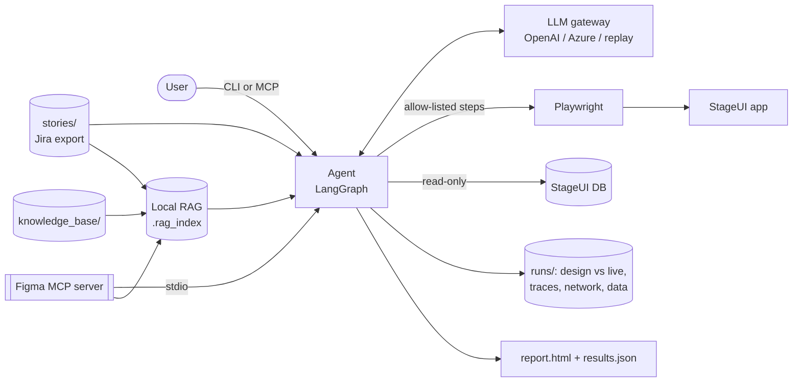

# StageUI Requirement & UX Assurance Agent

**Author:** Vivek Kaushik

An AI agent that answers one question with evidence: **does the StageUI implementation match the Jira story and the Figma design?**

It reads the story and the Figma file (over MCP), grounds itself in engineering context (local RAG), generates test scenarios traced to acceptance criteria (ACs), drives the StageUI app in a real browser, and checks UI, API, database and calculations. Every Figma frame and every AC gets a **PASS**, **GAP**, **DEFECT** or **RISK** verdict, backed by side-by-side screenshots, Playwright traces and data evidence.

- Product requirements: [docs/prd/001-stageui-requirement-assurance-agent.md](docs/prd/001-stageui-requirement-assurance-agent.md)
- Architecture: [docs/architecture/architecture.md](docs/architecture/architecture.md)
- Pluggable platform PRD: [docs/prd/002-pluggable-assurance-platform.md](docs/prd/002-pluggable-assurance-platform.md)
- Pluggable architecture and detailed design: [docs/architecture/002-pluggable-assurance-platform.md](docs/architecture/002-pluggable-assurance-platform.md)
- Local advisory evaluation enhancement: [docs/enhancements/001-local-advisory-output-evaluation.md](docs/enhancements/001-local-advisory-output-evaluation.md)
- Requirements Alchemist app: [requirements_alchemist/README.md](requirements_alchemist/README.md)
- Figma/PRD-to-story PRD: [docs/prd/003-requirements-alchemist.md](docs/prd/003-requirements-alchemist.md)
- Requirements Alchemist detailed design: [docs/architecture/004-requirements-alchemist.md](docs/architecture/004-requirements-alchemist.md)
- Requirements-generation flow: [docs/diagrams/requirements-alchemist-flow.md](docs/diagrams/requirements-alchemist-flow.md)
- Demo video: [DemoCapstoneProject.7z](DemoCapstoneProject.7z) (7-Zip archive with the recorded walkthrough, `DemoCapstoneProject.mp4`)

## Verdict labels

| Label | Meaning | Typical cause |
|---|---|---|
| **PASS** | Implementation matches the story and the design | All checks pass; differences are approved Figma variances only |
| **GAP** | Something the story or design asks for is missing or different | Component missing, wrong control type, flow trigger missing |
| **DEFECT** | Implemented but behaves wrongly | Wrong calculation, wrong navigation, wrong data |
| **RISK** | Cannot be verified with confidence | Ambiguous AC, login failure, locator only found by recovery |

Precedence when several apply: DEFECT > GAP > RISK > PASS. Labels come from deterministic checks (`agent/classifier.py`, `agent/conformance.py`). The LLM never decides a label.

## Results on the current StageUI build (live OpenAI run)

### Figma conformance (per frame)

| Frame | Route | Verdict | Evidence |
|---|---|---|---|
| Login | `/login` | PASS | 4 components and the `Log in → My Blogs` flow match |
| My Blogs | `/blogs` | **GAP** | Figma node 2:6 `Filter by tags` is a multi-select; StageUI renders a single-select dropdown |
| New Post | `/blogs/new` | PASS | `Publish` rendered as `Save post` is an approved variance; all flows land on the designed routes |

### Stories (per AC)

| Story | What it checks | Verdict | Why |
|---|---|---|---|
| BLOG-101 Log in | Valid and invalid login, Login frame | PASS | All checks pass |
| BLOG-102 Create post | Form, read-only author, publish, validation | PASS | Approved variance on the Publish button |
| BLOG-103 Metadata | Word count, reading time (UI vs API vs rule vs DB) | **DEFECT** (AC-03) | 450 words: UI and API show 2 min, rule `ceil(450/200)` gives 3 |
| BLOG-104 Tag filter | Multi-tag filter, clear filters | **GAP** (AC-01) | Cannot select `ai` and `travel` together: control is single-select |
| BLOG-105 Logout | Logout, session protection, "should load fast" | **RISK** (AC-03) | "Fast" has no threshold; load time is measured and reported only |

Replay-mode evaluation over 3 repeated runs: AC coverage 100%, label accuracy 100%, known issues detected 3/3, false positives 0, flake rate 0%, evidence completeness 100%. The live run above (gpt-4o-mini for planning, gpt-4o for the visual review) gives the same labels.

## Outputs and how to read them

Each run writes a folder `runs/<run-id>/` (for example `runs/20260927-183300/`). `runs/LATEST` holds the newest run id.

### 1. `report.html`: the human-readable verdict

Open it in any browser. Sections, top to bottom:

1. **Run header**: run id, author, StageUI URL, LLM provider and model, UX source (Figma fixture or REST), RAG embedder. Token usage per task is in `results.json`.
2. **Figma conformance summary**: one row per frame with route, verdict and a one-line rationale.
3. **Frame cards** (one per Figma frame):
   - **Design vs Live, side by side**: the Figma frame PNG next to a StageUI screenshot at the same viewport (1280×800). Components with a problem are outlined on the design image at their Figma position: **red** for missing or mismatched, **amber** for approved variances.
   - **Components table**: Figma node id, kind, label, status (`matched`, `missing`, `mismatch`, `approved_variance`, `skipped` for conditional states) and what was observed.
   - **Prototype flows table**: trigger, designed destination route, observed URL, status.
   - **Visual review (advisory)**: a vision model's list of layout/style differences with severity. It never changes the verdict.
   - **Evidence links**: design PNG, live PNG, Playwright trace, `verdict.json`.
4. **Story sections** (one per story): story verdict, recommendation, then one row per AC with verdict, rationale and links to the scenario steps, screenshots, traces and calculation files that justify it.

### 2. `results.json`: the machine-readable verdict

```json
{
  "meta": {"run_id": "...", "author": "Vivek Kaushik", "stage_base_url": "...", "llm_provider": "openai",
           "llm_model": "gpt-4o-mini", "ux_source": "fixture", "embedder": "...", "figma_llm_usage": {}},
  "figma_conformance": [
    {"frame": "My Blogs", "node_id": "2:1", "route": "/blogs", "label": "GAP", "rationale": "...",
     "components": [{"node_id": "2:6", "kind": "multi-select", "label": "Filter by tags",
                     "box": {"x": 0, "y": 0, "width": 0, "height": 0}, "status": "mismatch", "detail": "..."}],
     "flows": [{"trigger_label": "New post", "to_frame": "New Post", "expected_path": "/blogs/new",
                "observed_url": "...", "status": "ok", "detail": ""}],
     "visual_review": {"summary": "...", "observations": [{"area": "...", "difference": "...", "severity": "low"}]},
     "design_image": "figma/my-blogs/design.png", "live_image": "figma/my-blogs/live.png",
     "trace_path": "figma/my-blogs/trace.zip", "duration_ms": 0}
  ],
  "stories": [
    {"story_key": "BLOG-103", "label": "DEFECT", "recommendation": "...",
     "ac_verdicts": [{"ac_id": "AC-03", "label": "DEFECT", "rationale": "...", "scenario_ids": ["SC-103-03"], "evidence": ["..."]}],
     "scenario_results": ["..."], "intent_path": "...", "scenarios_path": "...", "llm_usage": {}, "duration_ms": 0}
  ]
}
```

Use it for CI gates (fail the pipeline on any DEFECT or GAP) or dashboards.

### 3. Evidence folder

```
runs/<run-id>/
  report.html  results.json
  figma/
    my-blogs/
      design.png       Figma frame export (MCP get_frame_image)
      live.png         StageUI screenshot of the frame's route
      verdict.json     frame verdict, components, flows, visual review
      step-*.png       screenshots of login and flow checks
      trace.zip        playwright show-trace runs\<id>\figma\my-blogs\trace.zip
      network.json     API calls captured (secrets masked)
  BLOG-103/
    intent.json        expected-behavior record built before execution
    scenarios.json     AC-tagged scenarios
    result.json        story verdict
    SC-103-03/
      step-01-goto.png ... step-06-check_calculation.png
      trace.zip  network.json
      calculation-reading_time.json   UI / API / rule / source values per post
```

## Architecture



- **Figma conformance** (once per run): for each frame, fetch components, routes and the frame PNG over MCP → open the route in StageUI → compare every component (kind, label, read-only, table columns) → click every prototype flow trigger and compare the landing URL with the designed route → optional vision review → frame verdict.
- **Story assurance** (per story): `reset_stage_data → load_story → load_ux_intent (MCP) → retrieve_context (RAG) → build_intent (LLM) → generate_scenarios (LLM) → execute_scenarios (Playwright, LLM recovery only on locator failure) → classify (rules) → report`.

## Folder map

| Folder | Role | Key files |
|---|---|---|
| `agent/` | The agent: chat harness, orchestration, conformance, validation, reporting, CLI | `chat.py`, `cli.py`, `orchestrator.py`, `conformance.py`, `executor.py`, `classifier.py`, `guardrails.py` |
| `agent/tools/` | Execution layer | `browser.py` (Playwright), `data.py` (read-only DB, 4-way calculation check), `figma_compare.py` |
| `agent/sources/` | Intent inputs | `jira.py` (file-based Jira), `figma_client.py` (MCP client) |
| `agent/reporting/` | Report generation | `report.py`, `templates/report.html.j2` |
| `llm/` | LLM gateway, provider-agnostic | `client.py`, `prompts/*.md`, `replay/` (recorded outputs) |
| `rag/` | Local RAG, no external DB | `ingest.py`, `embeddings.py`, `store.py`, `retriever.py` |
| `mcp_servers/figma_mock/` | Figma MCP server (fixture or real Figma REST) | `server.py`, `figma_parser.py`, `render_frames.py`, `fixtures/blog_notes.figma.json`, `fixtures/frames/*.png` |
| `mcp_servers/assurance_agent/` | The agent exposed as an MCP server | `server.py` |
| `stageui_app/` | StageUI application under test: "Blog Notes" (Flask + SQLite) | `app.py`, `seed.py`, `templates/` |
| `stories/` | Jira stories with ACs | `BLOG-101..105.json` |
| `knowledge_base/` | Engineering context for RAG | business rules, UI/API contract, test data, glossary, flow test data |
| `evals/` | Gold labels and evaluation runner | `gold_labels.json`, `run_eval.py` |
| `tests/` | Unit and integration tests | `test_*.py` |
| `runs/` | Output per run (gitignored) | `report.html`, `results.json`, evidence |

## Quick start (Windows PowerShell)

Python 3.10+ (tested with 3.14). No GPU needed.

```powershell
cd C:\Scaler\Cohort\PR-UX-assurance-agent
py -3.14 -m venv .venv
.venv\Scripts\activate
pip install -r requirements.txt
python -m playwright install chromium
copy .env.example .env          # set STAGE_PASSWORD (any value) and OPENAI_API_KEY (optional: replay mode without it)

python -m agent ingest          # build the local RAG index (pulls Figma via MCP)
python -m agent run --all --start-stage
start runs\<run-id>\report.html
```

Figma conformance only: `python -m agent conformance --start-stage`.
Watch the browser: add `--headed`.
Run the StageUI app by itself: `python -m stageui_app.seed` then `python -m stageui_app`, open http://127.0.0.1:5055 (user `alice`, password from `.env`).

## Chat with the agent

`python -m agent chat` opens a conversation in the terminal. You ask in plain English; the LLM decides which checks to run (Figma conformance, one or more stories, or just reading earlier results) and explains the verdicts with evidence paths. Verdicts still come from the deterministic checks, never from the LLM. It needs an LLM key.

```text
PS> python -m agent chat --headed
PR-UX Assurance Agent · openai (gpt-4o-mini) · 5 stories: BLOG-101, BLOG-102, BLOG-103, BLOG-104, BLOG-105

you> Is the tag filter implemented as designed?
  · list_stories()
  · run_story_assurance(story_keys=['BLOG-104'])
agent> GAP: The tag filter does not allow multiple selections as required by the design.
- AC-01: The control is single-select; cannot select multiple tags like ['ai', 'travel'].
  - Evidence files:
    - C:\...\runs\20260927-202614\BLOG-104\SC-104-02\trace.zip
- AC-02: This acceptance criterion passed successfully.
```

| You can ask | What the agent does |
|---|---|
| "What stories can you test?" | Lists stories and acceptance criteria |
| "Does the app match the Figma design?" | Runs Figma conformance; verdict per screen with design, live and trace paths |
| "Test BLOG-103 and explain any failure" | Runs that story; explains the DEFECT with UI, API and expected values |
| "Is the tag filter implemented as designed?" | Finds the matching story and runs it |
| "What does the reading time rule say?" | Searches the knowledge base, no browser |
| "What should block sign-off?" | Summarises verdicts from this session's runs |
| "Open the report" | Opens `report.html` of the latest run |

In-chat commands: `/headed` (show or hide the browser), `/usage` (tokens so far), `/help`, `/exit`. One-shot mode for scripts: `python -m agent chat --once "Does the app match the Figma design?"`.

## Commands

| Command | What it does |
|---|---|
| `python -m agent generate --story BLOG-104 --excel` | Generate a versioned draft test plan and human-review workbook without opening the target app |
| `python -m agent review import --story BLOG-104 --file test_plans/BLOG-104/v1.xlsx` | Validate reviewed steps and import approvals into the canonical JSON plan |
| `python -m agent plans [--story BLOG-104]` | List plan versions and review status counts |
| `python -m agent performance list` | List configurable page, feature, component, API and load profiles |
| `python -m agent performance run --profile blogs-page --start-stage` | Run a controlled profile and produce performance evidence |
| `python -m agent performance run --feature tag-filter` | Resolve and run the enabled profile for a feature |
| `python -m agent performance promote --run <id> --profile blogs-page --approved-by <name>` | Human-promote a stable passing run to the golden baseline |
| `python -m agent run-approved --story BLOG-104 --start-stage` | Execute only approved cases for a story |
| `python -m agent run-approved --frame "My Blogs"` | Execute approved cases linked to a Figma frame |
| `python -m agent run-approved --feature tag-filter` | Execute approved cases linked to a stable product feature |
| `python -m agent chat` | Chat in plain English; the agent picks and runs the checks |
| `python -m agent run --all` | Figma conformance for every frame, then assure every story |
| `python -m agent run --story BLOG-103` | Figma conformance, then assure one story (repeat `--story` for more) |
| `python -m agent run --all --no-figma` | Stories only, skip frame conformance |
| `python -m agent conformance` | Figma conformance only: per-frame verdict with design vs live evidence |
| `python -m agent figma` | Show frames, node ids, routes and design images from the Figma MCP server |
| `python -m agent search "reading time"` | Query the RAG index |
| `python -m agent ingest` | Rebuild the RAG index after editing stories or the knowledge base |
| `python -m agent graph` | Print the orchestrator graph as Mermaid |
| `python -m evals.run_eval --runs 3 --start-stage` | Label accuracy, frame accuracy, flake, evidence, latency, cost vs gold labels |
| `python -m pytest` | Tests |

## Governed test-plan workflow

The recommended workflow separates test design from execution:

1. `generate` grounds each acceptance criterion in Jira, Figma and hybrid RAG context and writes an immutable plan version under `test_plans/<story>/`.
2. The `.xlsx` projection contains Summary, Test Cases, Steps, Coverage, Sources and Human Review sheets. Reviewers may approve/reject cases and edit steps.
3. `review import` validates all edits against the constrained step schema, known ACs, target-origin guardrails, secret rules and spreadsheet-injection controls.
4. `run-approved` refuses draft cases and stale source versions, then selects approved cases by story, Figma frame or feature.
5. The workbook receives Results and Evaluation sheets after execution. JSON remains the canonical executable format.

Every run now finishes with a deterministic artifact audit in `eval.json`. It checks selected-case coverage, AC classification, evidence files, label consistency, report integrity and secret leakage. A failed audit returns exit code 3; it never changes PASS/GAP/DEFECT/RISK verdicts.

## Optional performance assurance

Performance is disabled by default. Set `PERFORMANCE_ENABLED=true`, or invoke
`python -m agent performance run ...` explicitly. Profiles live in
`config/performance.json` and can target a page, feature, component, API, or
load scenario. They configure cold/warm cache, viewport, CPU/network profile,
warm-ups, measured iterations, settled-state conditions, tools, and absolute
or golden-regression budgets.

The built-in Playwright collector records raw iterations and page/interaction
metrics without functional screenshots or traces. Optional integrations are:

- k6 browser for Web Vitals and repeatable user journeys;
- k6 protocol for backend concurrency and load;
- Lighthouse CI for page audits and resource budgets;
- OpenTelemetry for frontend-to-backend trace correlation;
- BenchmarkDotNet JSON as linked evidence for isolated .NET hot paths.

Each run writes `performance.json`, per-profile summaries and raw samples,
`performance/metrics.prom`, report tables, evaluation status, and an optional
Performance worksheet. Performance status is separate from functional labels:
`PASS`, `WARN`, `FAIL`, `UNSTABLE`, or `NOT_MEASURED`.

Golden promotion is an explicit human action and requires a passing
`eval.json`. Baselines under `performance-baselines/` are immutable and tied to
an environment fingerprint. The optional stack in `observability/` runs local
Grafana, Prometheus, Tempo, and OpenTelemetry Collector with a provisioned
current-versus-golden dashboard.

## Optional local advisory evaluation

DeepEval/G-Eval can review recommendation consistency and evidence grounding
after deterministic execution. It is disabled by default and never changes
PASS/GAP/DEFECT/RISK, performance status, or `eval.json`.

Install the optional evaluator and enable it:

```powershell
pip install -r requirements-evaluation.txt
$env:ADVISORY_EVALUATION_ENABLED = "true"
python -m agent run --story BLOG-103
```

`config/advisory-evaluation.json` defaults to local Ollama at
`http://127.0.0.1:11434/v1`. Change the provider, model, and base URL for a
local vLLM server or an explicitly configured remote OpenAI-compatible
endpoint. Enabled runs add `advisory-eval.json` and an advisory section to
`report.html`.

Optional OTLP export projects bounded score spans to the local Collector for a
self-hosted Opik, Langfuse, or generic OTLP backend. The JSON artifact remains
canonical and no recommendation text or evidence content is exported as span
attributes.

## Pointing at another web application

Playwright is framework-independent, so the generic adapter can test React, Angular, Vue and server-rendered sites. Copy `config/apps/generic.example.json`, then set:

```dotenv
TARGET_ADAPTER=generic_web
TARGET_PROFILE=config/apps/my-app.json
TARGET_BASE_URL=https://stage.example.com
TARGET_ALLOWED_ORIGINS=https://stage.example.com
TARGET_AUTH_METHOD=form
TARGET_USER=qa-user
TARGET_PASSWORD=...
```

Authentication modes are `form`, `storage_state`, `headers`, and `none`. Use a gitignored Playwright storage-state file for SSO/MFA; never place credentials in stories, prompts, plans or Excel. Generic targets do not start or reset automatically, and unsupported DB/calculation probes become RISK instead of silently using StageUI behavior. The legacy `STAGE_*` variables remain supported.

## Configurable agent tools

`config/tools.json` is the shared registry for chat, recovery and MCP-facing tools. A tool declares its JSON input schema, enabled surfaces, risk, timeout, required capabilities and one handler:

- `builtin`: a registered in-process handler
- `python`: an allow-listed `module:function` plugin
- `mcp`: a tool on a configured stdio, SSE or streamable-HTTP MCP server

Disabled, over-risk or missing-capability tools are not shown to the model and cannot be invoked. Set `AGENT_TOOLS_CONFIG` to use another registry and `AGENT_TOOL_CAPABILITIES` to grant comma-separated capabilities.

Common flags: `--start-stage` starts the StageUI app for the run, `--no-reset` skips the data reset, `--headed` shows the browser.

### From Cursor or any MCP client

Add to `.cursor/mcp.json`:

```json
{
  "mcpServers": {
    "figma-mock": {
      "command": "C:\\Scaler\\Cohort\\PR-UX-assurance-agent\\.venv\\Scripts\\python.exe",
      "args": ["-m", "mcp_servers.figma_mock.server"],
      "env": { "PYTHONPATH": "C:\\Scaler\\Cohort\\PR-UX-assurance-agent" }
    },
    "PR-UX-assurance-agent": {
      "command": "C:\\Scaler\\Cohort\\PR-UX-assurance-agent\\.venv\\Scripts\\python.exe",
      "args": ["-m", "mcp_servers.assurance_agent.server"],
      "env": { "PYTHONPATH": "C:\\Scaler\\Cohort\\PR-UX-assurance-agent" }
    }
  }
}
```

Agent tools: `list_stories`, `check_figma_conformance` (per-frame verdicts and report path) and `run_assurance` (per-AC verdicts for a story). Example prompt: *"Check whether StageUI matches the Figma design"*.

## LLM

| Mode | How to enable | Used for |
|---|---|---|
| `openai` | `OPENAI_API_KEY` (`OPENAI_MODEL`, default `gpt-4o-mini`; `VISION_MODEL`, default `gpt-4o`) | Intent building, scenario generation, locator recovery, recommendations, visual review |
| `azure` | `AZURE_OPENAI_ENDPOINT`, `AZURE_OPENAI_API_KEY`, `AZURE_OPENAI_DEPLOYMENT`, `AZURE_OPENAI_VISION_DEPLOYMENT` | Same |
| any OpenAI-compatible | `OPENAI_BASE_URL` + key | Same |
| `replay` (no key) | nothing | Recorded outputs in `llm/replay/`; zero cost, repeatable. No visual review |

`LLM_RECORD=1` saves live outputs into `llm/replay/`. The key is read from `.env`, which is gitignored; never commit it.

## Local RAG

- Sources: `stories/` (one chunk per story and per AC), `knowledge_base/*` (heading and structured flow chunks), Figma frames, features and approved variances.
- Embeddings: OpenAI `text-embedding-3-small` when a key is set, otherwise an offline hashing embedder.
- Store: numpy matrix + JSON in `.rag_index/`; hybrid cosine + pure-Python BM25 retrieval with reciprocal-rank fusion and metadata filters.
- Retrieval runs per AC, resolves exact business-rule IDs, records stable citations/conflicts and warns when the index manifest is stale.
- `python -m evals.run_retrieval_eval` runs the offline retrieval gold set.

## Figma MCP

`mcp_servers/figma_mock/server.py` is an MCP server (stdio) with these tools: `get_file_info`, `list_frames`, `get_frame_components`, `get_prototype_flows`, `get_approved_variances`, `get_story_frames`, `get_frame_routes` and `get_frame_image`.

- `FIGMA_SOURCE=fixture` (default): serves `fixtures/blog_notes.figma.json` in the same JSON shape as Figma's `GET /v1/files/:key` (with `absoluteBoundingBox` per node), and frame PNGs from `fixtures/frames/` (regenerate with `python -m mcp_servers.figma_mock.render_frames`).
- `FIGMA_SOURCE=rest`: set `FIGMA_TOKEN` and `FIGMA_FILE_KEY`. The same parser reads your file and `get_frame_image` downloads PNGs from `GET /v1/images/:key`. Name component instances `TextInput`, `Button`, `MultiSelect`, `Table`… and put the label in a `Label` property.
- Frame routes (`x-frameRoutes`), story links (`x-storyLinks`) and approved variances (`x-approvedVariances`) are file-level metadata; in a real Figma file they map to Dev Mode links and annotations.

## Guardrails and data handling

| Risk | Control |
|---|---|
| Destructive actions | Allow-listed step language; clicks or paths matching delete/remove/reset/admin are refused and recorded; a refusal blocks PASS |
| Leaving StageUI | Navigation restricted to `STAGE_BASE_URL`; DB opened read-only (`mode=ro`, SELECT only) |
| Credentials and PII | `${STAGE_USER}` / `${STAGE_PASSWORD}` placeholders resolved only inside the browser tool; the LLM never sees them. Password masked in logs, reports, `network.json` and inside Playwright traces |
| Hallucinated requirements | Intent saved before execution; scenarios citing unknown AC ids are dropped; unmeasurable ACs become RISK |
| Vision false positives | Visual review is advisory; notes about conditional states or approved variances are filtered out |
| Flakiness | StageUI data reset before every story; state-aware waits; flake rate measured by `evals/run_eval.py` |
| HTML injection in reports | Report template autoescapes all story and evidence text |

## Failure analysis

| What happened | Fix |
|---|---|
| `mcp` 2.x renamed `FastMCP` and broke the server | Pinned `mcp>=1.9,<2` |
| Playwright traces contained the plaintext password | Traces scrubbed after each scenario (`guardrails.scrub_zip`); verified 0 leaks |
| A failed multi-tag selection cascaded into a false DEFECT on the row check | Steps after a failed interaction are marked `skipped`, so the AC is GAP |
| Live scenario generation used `label=` targets for buttons, links and headings | Browser tool resolves equivalent forms (label, button, link, heading, text) of the same name and records how it resolved; prompt gives a target rule per Figma kind |
| Live scenarios used `${STAGE_USER}` as the display name, hard-coded reading times, and expected Bob's posts on Alice's list | Prompt rules for credentials, calculations and row checks; full test data (with visibility and tag expectations) passed to the LLM |
| `expect_value` used on table cells | Falls back to the element's text for non-input elements |
| Live plans asserted hard-coded numbers ("450", "3 min") on the first table row, added a reading-time check to the "publish" criterion, and used the kind `error-text` as a label | Plans are normalized after generation: hard-coded derived numbers are replaced by `check_calculation`, calculation checks are kept only on criteria that mention them, and kind names used as labels become text targets. Each change is recorded in the run notes |
| A "post not saved" check read the My Blogs list while still on the New post form | `expect_rows` opens My Blogs first, like `check_calculation` |
| gpt-4o-mini visual review reported conditional error text and the approved "Save post" label as high severity, and used about 222k image tokens per run | Prompt lists expected components, conditional states and approved variances; matching notes filtered; vision model switched to gpt-4o (about 8k tokens) |
| gpt-4o visual review does not notice the multi-select vs dropdown difference | Accepted: the deterministic component check catches it and sets the GAP; the visual review is advisory only |
| Report dropped `<display name>` from AC text | Jinja autoescape forced on |
| Windows console crashed on `▶` / `⇒` | CLI forces UTF-8 output |

## Roadmap

- Replace `agent/sources/jira.py` with Jira Cloud REST behind the same functions.
- Add a single-prompt baseline to `evals/` to compare against the agentic flow.
- Pixel-diff scoring per component box to complement the vision review.
