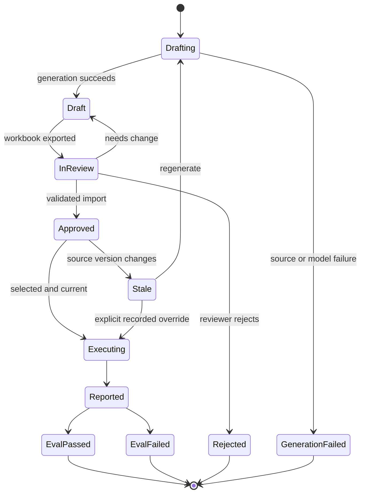
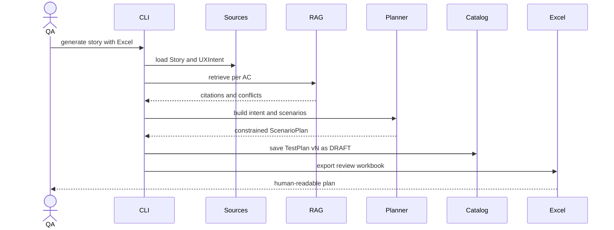
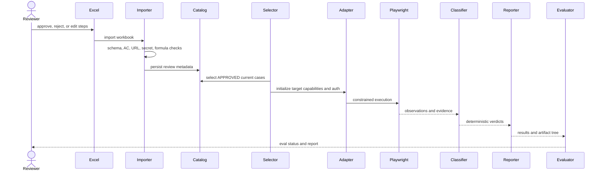
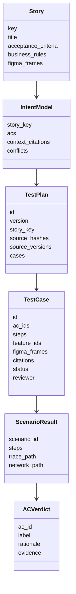
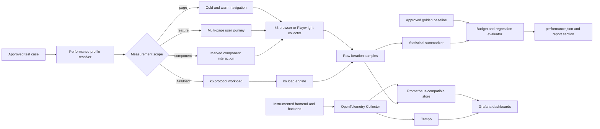
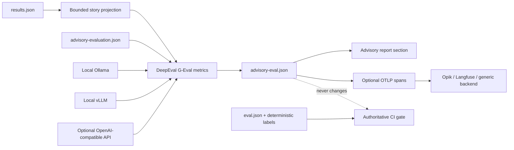
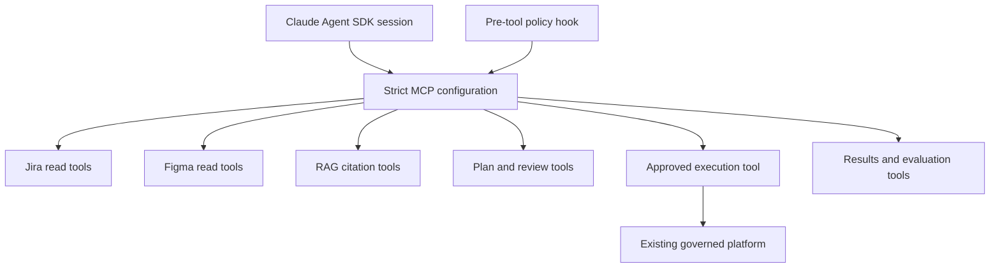

# Architecture and Detailed Design: Pluggable Assurance Platform

| Field | Value |
|---|---|
| Status | Proposed architecture; Phase 1 implemented |
| Author | Vivek Kaushik |
| Product requirements | [PRD-002](../prd/002-pluggable-assurance-platform.md) |
| Previous architecture | [StageUI v1 architecture](architecture.md) |

## 1. Architecture objectives

The architecture separates seven concerns that must not collapse into one autonomous loop:

1. source ingestion and grounding;
2. test planning and human approval;
3. safe target execution;
4. deterministic classification and evidence;
5. controlled performance measurement and observability;
6. optional non-authoritative model-based output evaluation;
7. orchestration by a replaceable agent harness.

The core invariant is:

> A reasoning model may propose what to test and may recover a locator, but it cannot approve a plan, expand its own capabilities, execute outside policy, or assign a verdict.

## 2. System context

```mermaid
flowchart LR
    User[QA, PO, Designer, Developer] --> Interfaces[CLI, Chat, MCP, CI]
    Interfaces --> Harness[Harness abstraction]
    Harness --> Planning[Planning service]
    Harness --> GovernedTools[Guarded tool registry]

    Jira[Jira export or Jira adapter] --> Planning
    Figma[Figma MCP] --> Planning
    Knowledge[Rules, contracts, test data] --> RAG[Hybrid RAG]
    Jira --> RAG
    Figma --> RAG
    RAG --> Planning

    Planning --> Catalog[Versioned test catalog]
    Catalog --> Excel[Excel review projection]
    Excel --> Approval[Validated approval import]
    Approval --> Catalog

    Catalog --> Selector[Story, frame, feature selector]
    Selector --> Execution[Approved execution]
    GovernedTools --> Execution
    Execution --> Adapter[Target application adapter]
    Adapter --> Browser[Playwright]
    Browser --> Target[Web application under test]

    Execution --> Evidence[Evidence store]
    Execution --> Performance[Performance measurement service]
    Performance --> PerfStore[Prometheus-compatible time-series store]
    Target --> Telemetry[OpenTelemetry traces and service metrics]
    Telemetry --> Performance
    PerfStore --> Grafana[Local Grafana dashboards]
    Evidence --> Classifier[Deterministic classifier]
    Classifier --> Reports[HTML, JSON, workbook]
    Performance --> Reports
    Reports --> Evaluator[Artifact evaluator]
    Evaluator --> Gate[CI quality gate]
    Reports --> Advisory[Optional DeepEval / G-Eval]
    Advisory --> Review[Advisory scores and human review]
    Advisory --> EvalOTel[OTLP score spans]
    EvalOTel --> EvalDashboard[Opik / Langfuse / OTel backend]
```



## 3. Runtime modes

| Mode | Harness | Intended use | Target mutation |
|---|---|---|---|
| Planning | LangGraph or Claude | Generate intent and draft plans | None |
| Review | No model required | Export/import Excel decisions | None |
| Approved execution | LangGraph deterministic path | CI and release assurance | Only allow-listed test interactions |
| Chat | Current LLM tool chooser or optional Claude | Human exploration and orchestration | Only through governed tools |
| Replay | Recorded model outputs | Offline tests and demos | Reference StageUI only when execution requested |
| Conformance | Deterministic frame/flow checks plus advisory vision | Design validation | Safe form/flow interactions |

## 4. Logical component architecture

### 4.1 Source adapters

| Component | Current implementation | Contract |
|---|---|---|
| Jira | `agent/sources/jira.py`, local JSON | `list_story_keys`, `load_story` → `Story` |
| Figma | `agent/sources/figma_client.py`, MCP | `UXIntent` with frames, flows, routes, images, variances, features |
| Knowledge | `stories/`, `knowledge_base/` | Versioned files transformed into `Chunk` objects |
| Target application | `agent/adapters/` | Authentication, reset, context, capability, secret, and application-specific probes |
| LLM provider | `llm/client.py` | Structured text, vision, tool choice, usage |
| Harness | LangGraph today; Claude proposed | Invoke registered planning and execution capabilities |

### 4.2 Domain services

| Service | Responsibility |
|---|---|
| Intent builder | Normalize each AC into precondition, action, expected result, checks, ambiguity, citations, conflicts |
| Scenario generator | Produce constrained AC-linked scenarios and normalize unsafe/unsupported model output |
| Test catalog | Persist immutable generated versions and controlled review updates |
| Excel I/O | Project plans for humans and validate imported decisions/steps |
| Tool registry | Discover and authorize built-in, Python, and MCP tools |
| Executor | Enforce step guardrails and run scenarios through Playwright |
| Classifier | Convert observed step status into deterministic verdicts |
| Reporter | Build machine and human outputs |
| Artifact evaluator | Audit report consistency, evidence, coverage, gold labels, and secrets |
| Performance service | Run controlled page, feature, component, API, and load measurements; compare distributions with budgets and approved baselines |
| Telemetry exporter | Persist low-cardinality metrics and trace links for local Grafana dashboards |
| Advisory evaluator | Score recommendation consistency and evidence grounding with DeepEval/G-Eval while remaining outside verdict and CI authority |

## 5. Governed lifecycle



### 5.1 Planning sequence



### 5.2 Approval and execution sequence



## 6. Domain data design

### 6.1 Core entities



### 6.2 Plan identity and immutability

- `version` is monotonically increasing per story.
- `id` combines story, version, and a source-hash digest.
- Generation writes a new `vN.json` and updates `LATEST`.
- Review import may update only the matching version's review and validated step fields.
- Regeneration never overwrites a plan version.
- Jira/knowledge files are stored in `source_hashes`.
- Figma version is stored in `source_versions`.
- `run-approved` compares current sources before execution.

### 6.3 Review status

| Status | Executable | Meaning |
|---|---|---|
| DRAFT | No | Generated or returned for edits |
| APPROVED | Yes, if current | Human accepts test intent and steps |
| REJECTED | No | Test case must not execute |
| NEEDS_CHANGE | No | Reviewer requests regeneration or editing |

## 7. RAG architecture

### 7.1 Ingestion

The index uses:

- one chunk per story;
- one chunk per AC;
- one chunk per Markdown heading;
- structured flow-prerequisite chunks;
- one chunk per Figma frame;
- one chunk per approved variance.

Chunk metadata includes:

```json
{
  "doc_type": "business_rule",
  "story": "BLOG-103",
  "ac": "AC-03",
  "rule_id": "BR-META-02",
  "frame": "My Blogs",
  "feature": ["post-metadata"],
  "source_path": "knowledge_base/business_rules.md",
  "source_version": "sha256:...",
  "content_hash": "sha256:..."
}
```

### 7.2 Retrieval algorithm

1. Apply metadata filters to candidate chunks.
2. Compute normalized dense cosine scores.
3. Compute pure-Python BM25 lexical scores.
4. Rank each channel independently.
5. Fuse ranks with reciprocal-rank fusion.
6. Boost exact business-rule identifiers and heading overlap.
7. Apply optional final-score threshold.
8. Return stable citation labels `[C1]`, `[C2]`, and so on.

The implementation remains numpy/JSON based to avoid native vector-store dependencies on Windows.

### 7.3 AC-aware retrieval

| AC check type | Preferred document types |
|---|---|
| UI | business rule, test data, glossary |
| API/data | API contract, test data, business rule |
| Calculation | exact rule, API contract, source-data contract |
| Figma | frame, variance, linked feature |
| Performance | measurable thresholds; otherwise ambiguity |

### 7.4 Freshness

`.rag_index/manifest.json` records:

- schema version;
- embedding implementation;
- source file hashes;
- Figma UX hash and version;
- chunk count;
- build time.

Source changes generate a warning and require re-ingestion before trusted plan generation.

## 8. Jira integration design

### 8.1 Current adapter

Local JSON remains the deterministic reference implementation. It is appropriate for replay, unit tests, and demos.

### 8.2 Live Jira options

| Option | Advantages | Trade-offs |
|---|---|---|
| Jira REST adapter | Direct control over field mapping, pagination, caching, errors | Platform must maintain auth and API compatibility |
| Jira MCP server | Shared tool contract across harnesses | Server availability and schema become dependencies |

Both options must normalize to `Story`; downstream components must not depend on raw Jira payloads.

### 8.3 Proposed Jira configuration

```dotenv
JIRA_SOURCE=rest
JIRA_BASE_URL=https://company.atlassian.net
JIRA_PROJECT_KEY=WEB
JIRA_USER_EMAIL=
JIRA_API_TOKEN=
```

Required behavior:

- load by exact key;
- list eligible stories;
- map configured AC fields;
- retain Jira updated timestamp/version;
- handle pagination and rate limits;
- mask credentials and user PII;
- fail generation rather than use partial story data.

## 9. Figma integration design

The Figma MCP server is the UX boundary. It exposes semantic design intent rather than requiring the harness to interpret raw Figma JSON.

| MCP tool | Consumer |
|---|---|
| `get_file_info` | freshness/version |
| `list_frames` | conformance and discovery |
| `get_frame_components` | scenario planning and deterministic comparison |
| `get_prototype_flows` | navigation checks |
| `get_approved_variances` | normalization and conformance |
| `get_story_frames` | Jira-to-design linkage |
| `get_features` | story/AC/frame/node feature linkage |
| `get_frame_routes` | safe target navigation |
| `get_frame_image` | report and advisory vision |

Real Figma mode may use REST for file/image access while preserving annotation metadata through fixture/config defaults. Production adoption should move routes, story links, features, and variances into a governed design metadata source.

## 10. Target adapter design

### 10.1 Adapter contract

A target adapter provides:

- `login_steps()`;
- `reset()`;
- browser context options;
- secret values for scrubbing;
- exact allowed origins;
- health URL and optional local start module;
- capability declarations;
- list/row semantics;
- optional application-specific calculations or data probes.

### 10.2 StageUI adapter

The reference adapter supports:

- local Flask startup;
- seed reset;
- username/password login;
- `/blogs` list semantics;
- read-only SQLite source query;
- UI/API/rule/source calculation reconciliation.

### 10.3 Generic-web adapter

The generic adapter supports:

| Auth mode | Design |
|---|---|
| `form` | Configured login path, labels, and submit button; placeholders resolved locally |
| `storage_state` | Gitignored Playwright state file, suitable for SSO/MFA prepared by an operator |
| `headers` | Configured context headers; values added to secret scrubbing |
| `none` | No login actions |

It performs no reset, DB query, or calculation unless an application-specific extension declares those capabilities.

## 11. Tool registry design

### 11.1 Tool descriptor

```json
{
  "name": "search_example",
  "description": "Search an approved source.",
  "input_schema": {
    "type": "object",
    "properties": {"query": {"type": "string"}},
    "required": ["query"],
    "additionalProperties": false
  },
  "enabled": false,
  "surfaces": ["chat", "mcp"],
  "risk": "low",
  "timeout": 10,
  "capabilities": ["source.read"],
  "handler": {
    "type": "mcp",
    "server": "example",
    "tool": "search"
  }
}
```

### 11.2 Authorization

A tool is available only when:

1. it is enabled;
2. the current surface is listed;
3. its risk does not exceed the caller's maximum;
4. all required capabilities were granted;
5. its input validates against JSON schema.

Python handlers are resolved from explicit import paths. MCP handlers use configured transport and are not discovered from arbitrary user prompts.

### 11.3 Tool surfaces

| Surface | Typical tools | Maximum authority |
|---|---|---|
| Chat | list/show/search/generate/results | Read and planning; explicit governed execution only |
| Planning | Jira, Figma, RAG | Read-only |
| Recovery | click, fill, select, give-up | Current target and current scenario only |
| MCP | Explicit platform API | Configured low-risk tools by default |
| CI | Approved execution and evaluation | Non-interactive, policy-bound |

## 12. Execution and classification

### 12.1 Step language

The model emits Pydantic-validated steps such as `goto`, `fill`, `click`, `select`, `expect_*`, `check_calculation`, `figma_check`, `measure_load`, and `screenshot`.

Before each interaction:

- URL scheme and exact origin are checked;
- destructive paths and targets are denied;
- read-only mode is enforced;
- placeholders remain unresolved until the browser layer;
- unsupported adapter capabilities return evidence-bearing error/RISK behavior.

### 12.2 Recovery

Locator recovery is the only bounded ReAct-style loop in execution:

1. deterministic planned locator fails;
2. a secret-free page snapshot is produced;
3. the model selects one registered recovery tool;
4. guardrails run again;
5. retry count is bounded;
6. successful recovery is recorded and prevents an unqualified PASS.

### 12.3 Verdict rules

The classifier remains independent of harness and provider:

```text
DEFECT > GAP > RISK > PASS
```

- contradiction after a completed check → DEFECT;
- missing capability or required design element → GAP;
- ambiguity, refusal, execution error, recovery, or incomplete evidence → RISK;
- complete and consistent evidence → PASS.

## 13. Reporting and artifact evaluation

### 13.1 Outputs

```text
runs/<run-id>/
  results.json
  report.html
  eval.json
  advisory-eval.json  # only when enabled
  figma/<frame>/
  <story>/<scenario>/
```

Approved-plan workbooks gain:

- `Results`;
- `Evaluation`.

### 13.2 Evaluation checks

| Check | Validation |
|---|---|
| Artifacts | `results.json` and `report.html` exist and parse |
| Story labels | Story label equals deterministic precedence of AC labels |
| Evidence | Referenced screenshots, traces, network, intent, and scenario files exist |
| Approved coverage | Selected approved cases ran and their ACs were classified |
| Grounding | Approved cases contain citations and current source status |
| Secrets | Configured values and high-confidence token patterns absent, including ZIP members |
| Gold | Optional AC/frame labels match maintained human gold |

The evaluator writes a result even for partial or malformed runs. Evaluation
failure uses a separate process exit code and never rewrites verdicts.

### 13.3 Performance measurement architecture

Performance is a separate governed pass over an approved functional case. It
must not derive a benchmark from screenshot-heavy functional execution because
tracing, screenshots, video, locator recovery, and test-data reset add
significant observer overhead. A functional run may emit diagnostic timings,
but a performance verdict comes only from a controlled performance profile.



#### Measurement scopes

| Scope | Unit under test | Primary measurements | Example |
|---|---|---|---|
| Page | One route in a defined auth/cache state | TTFB, FCP, LCP, CLS, INP, DOM/load, transfer bytes, request count, JS/CSS usage | `/orders` cold and warm |
| Feature journey | Named sequence spanning components, APIs, and pages | End-to-end duration, step durations, Web Vitals by page, request latency/error rate, trace IDs | Search → result → details |
| Component interaction | A stable locator plus action and settled-state condition | interaction-to-settled duration, INP/event duration, long tasks, render/layout work, related API calls | Open cart drawer |
| API/service | Backend operation linked to a feature | request p50/p90/p95/p99, throughput, errors, server spans, DB/cache spans | `GET /api/orders` |
| Load | Protocol or browser concurrency profile | latency distribution, throughput, saturation, errors, service resources | 50 users browsing orders |

Component performance is not the time to locate an element. It is measured
from an explicit `performance.mark` immediately before the user action to a
configured settled condition such as a visible state, route, response, or
application-emitted mark. Every profile must declare that end condition.

#### Tool choices

| Tool | Recommended role | Strength | Constraint |
|---|---|---|---|
| Existing Playwright runner | Per-test diagnostic collector and targeted component/page probes | Reuses approved flows; Performance API, Resource Timing, HAR, JS/CSS coverage, CDP metrics and Chromium traces | Not a load generator; normal functional traces and screenshots distort timings |
| Grafana k6 browser | Primary repeatable page/feature benchmark | Core Web Vitals, custom `performance.mark` measures, tagged trends, thresholds, browser plus protocol scenarios | Chromium-oriented; browser VUs are resource intensive |
| Grafana k6 protocol | Backend/load phase linked to the same feature | High concurrency, request distributions, checks, thresholds, Prometheus remote write | Does not measure rendering or component interaction |
| Lighthouse CI | Page-level cold-load audit and resource budgets | Performance/accessibility audits, bundle/resource budgets, repeat runs, CI assertions | Poor fit for authenticated multi-page feature journeys and sustained load |
| OpenTelemetry | Frontend-to-backend causality | W3C trace context links document/fetch/XHR spans to services, databases and caches | Requires application instrumentation and safe OTLP/CORS configuration |
| BenchmarkDotNet | Optional .NET microbenchmarks owned by backend repositories | Process isolation, JIT/pilot/warm-up/actual stages, allocation/GC diagnostics and statistical output | It benchmarks methods, not browser pages or distributed user journeys |

BenchmarkDotNet is therefore complementary, not the platform's UI benchmark
engine. A feature report may link a BenchmarkDotNet artifact for a hot .NET
method, but k6 browser/protocol plus OpenTelemetry provide the appropriate
end-to-end signal.

#### Benchmark methodology

The runner adopts the useful parts of BenchmarkDotNet's discipline:

1. pin browser version, viewport, CPU/network profile, target build and dataset;
2. separate cold-start and warm-cache jobs;
3. run one untimed setup plus configurable warm-up iterations;
4. execute independent measured iterations in fresh contexts when isolation is
   required;
5. retain every raw sample and report median, p75, p90, p95, min/max, standard
   deviation, median absolute deviation and coefficient of variation;
6. mark unstable results when sample count or variance is outside policy;
7. compare current and baseline distributions, not one current value against
   one historic value;
8. fail only on an explicit absolute budget, an approved relative-regression
   budget, or both.

Outliers are retained in raw artifacts. Any exclusion rule must be configured,
reported, and applied equally to current and baseline samples. Performance
tests run on controlled agents; developer-laptop measurements are informative
but do not update the golden baseline.

### 13.4 Dynamic performance profiles

Performance behavior is configuration, not hard-coded scenario logic. A
profile may be linked from a story, feature, Figma frame, page route, test case,
or component node/test ID.

```yaml
id: order-details-performance
scope: feature
selector:
  feature: order-details
steps:
  - goto: /orders
  - click: {testid: order-42}
measurements:
  - id: orders-page
    start: navigation
    end: network-idle
  - id: open-order
    start: before-action
    end: {visible: {testid: order-details}}
browser:
  viewport: {width: 1280, height: 800}
  cache: [cold, warm]
  warmups: 2
  iterations: 10
budgets:
  lcp_ms: {p90_max: 2500, regression_max_percent: 10}
  open-order_ms: {p95_max: 800, regression_max_percent: 15}
  http_error_rate: {max: 0.01}
observability:
  trace_header: traceparent
  backend_services: [web-api, orders-service]
```

Resolution order is `test case override → component → feature → page → target
default`. Conflicting profiles fail validation. Dynamic URLs are normalized to
stable route/feature tags before export; raw URLs, user IDs, story text and
component labels are not time-series labels.

Add these domain records:

- `PerformanceProfile`: scope, setup, action, end condition, environment,
  repetitions, metrics, budgets and baseline policy;
- `PerformanceSample`: run/build/profile/iteration plus raw metric values and
  trace IDs;
- `PerformanceSummary`: distributions, stability, budget outcomes and
  current-to-baseline deltas;
- `PerformanceBaseline`: immutable approved summary with environment
  fingerprint, source build and approver;
- `PerformanceVerdict`: `PASS`, `WARN`, `FAIL`, `UNSTABLE`, or `NOT_MEASURED`.

Performance status remains separate from functional `PASS/GAP/DEFECT/RISK`.
When a Jira AC contains an explicit measurable performance threshold, a failed
budget may also deterministically produce a functional `DEFECT`. Ambiguous
phrases such as "loads fast" remain `RISK` until a human approves a budget.

### 13.5 Local Grafana and golden comparison

Grafana can be hosted locally and is recommended for exploration and trends,
but it is not the canonical test verdict or golden source. The local Docker
Compose topology is:

```text
k6 browser/protocol ──Prometheus remote write──> Prometheus
application ──OTLP──> OpenTelemetry Collector ──> Prometheus + Tempo
Grafana ──queries──> Prometheus + Tempo
```

The minimum profile is Grafana plus a Prometheus-compatible store. Add Tempo
when frontend/backend trace correlation is required. For longer local retention
or many runs, a persistent Prometheus-compatible store such as VictoriaMetrics
may replace Prometheus without changing dashboard queries.

Provision dashboards and data sources from version-controlled files. Required
dashboard variables are target, environment, branch, build, run, story,
feature, page, component and cache/device profile. Recommended panels:

- current versus golden p50/p90/p95;
- absolute and percentage regression;
- Core Web Vitals by page;
- feature and component interaction duration;
- backend request latency/error/throughput;
- resource count/bytes and unused JS/CSS;
- variance and sample stability;
- links from a slow sample to its Tempo trace and run evidence.

The golden is an approved, immutable `performance-baselines/*.json` artifact
with raw-summary provenance—not a screenshot or Grafana dashboard state. Each
run compares against that file deterministically and exports both current and
golden series with `run_kind=current|baseline`. Grafana overlays the series.
Baseline promotion is a separate human-controlled command and is denied when
the run is unstable, the environment fingerprint differs, or functional/eval
checks failed.

Time-series labels must remain bounded. Use stable identifiers such as
`profile_id`, `feature_id`, normalized route and component test ID; keep
`run_id`, commit and trace ID in exemplars or artifact metadata where supported
rather than creating unbounded label combinations.

### 13.6 Open-source advisory evaluation

The deterministic classifier and artifact evaluator remain authoritative.
DeepEval/G-Eval is an optional second pass over the already-emitted,
secret-scrubbed `results.json`. It judges explanation quality, not product
behavior.



The adapter uses lazy imports so ordinary runs do not require DeepEval. Judge
providers share an OpenAI-compatible interface:

- Ollama defaults to `http://127.0.0.1:11434/v1`;
- vLLM points to its local `/v1` endpoint;
- a remote compatible provider reads its API key from the configured
  environment-variable name.

Each metric has a stable ID, criteria or explicit evaluation steps, threshold,
and enabled state. The initial metrics are:

1. deterministic verdict and recommendation consistency;
2. evidence-grounded explanation quality.

The output records engine, model, provider, score, threshold, reason, errors,
and export status and explicitly serializes `authoritative: false`. A fail-open
policy records evaluator/dependency/model failures without hiding them or
preventing deterministic reports from completing.

OTLP export emits bounded score spans to the local Collector. Opik or Langfuse
may receive those spans when configured as downstream OpenTelemetry backends.
The portable JSON artifact remains canonical; dashboards are projections.

## 14. Optional Claude Agent SDK harness

### 14.1 Decision

Claude is not required for RAG, Jira, Figma, Playwright, or evals. Those are platform services. Claude is valuable when the product needs:

- resumable conversational sessions;
- richer multi-step tool orchestration;
- subagents for source review or report explanation;
- programmatic hooks and permissions;
- an alternative harness for comparative evals.

The recommended pattern is an additional harness, not a replacement for the core.



### 14.2 Proposed code changes

```text
agent/harnesses/
  base.py
  langgraph.py
  claude.py
```

Add:

- `claude-agent-sdk`;
- `ANTHROPIC_API_KEY`;
- `CLAUDE_MODEL`;
- `AGENT_HARNESS=langgraph|claude`;
- an in-process or configured MCP server exposing platform operations;
- JSON-schema output based on existing Pydantic models;
- a pre-tool hook for all sensitive calls;
- harness telemetry and comparative evals.

### 14.3 Claude tool profile

Allowed:

- list/show Jira stories;
- retrieve Figma intent;
- search RAG;
- generate/export plans;
- list approval state;
- invoke approved execution;
- read summarized results/evaluation.

Disallowed:

- unrestricted `Bash`;
- arbitrary `Write` or `Edit`;
- direct Playwright/browser tools;
- raw credentials;
- direct database mutation;
- plan approval;
- verdict assignment.

Recommended SDK controls:

- strict MCP configuration;
- explicit allowed and disallowed tools;
- pre-tool hooks rather than relying only on prompt instructions;
- maximum turns and budget;
- structured JSON output;
- separate planning and execution sessions at the human approval boundary;
- session/cost telemetry.

### 14.4 Harness comparison evals

Both LangGraph and Claude receive the same:

- normalized stories and UX;
- RAG index;
- tool schemas;
- controlled test data;
- approved execution plans;
- target build;
- gold labels.

Compare:

| Metric | Purpose |
|---|---|
| AC/test coverage | Planning completeness |
| Citation precision | Groundedness |
| Invalid scenario rate | Schema and instruction adherence |
| Forbidden tool-call attempts | Safety |
| Human plan acceptance rate | Test usefulness |
| Verdict agreement | End-to-end stability |
| Tokens, cost, latency | Operational trade-off |
| Session/tool rounds | Harness efficiency |

## 15. Configuration model

### 15.1 Target

```dotenv
TARGET_ADAPTER=generic_web
TARGET_PROFILE=config/apps/my-app.json
TARGET_FEATURE_MAP=config/features.json
TARGET_BASE_URL=https://stage.example.com
TARGET_ALLOWED_ORIGINS=https://stage.example.com
TARGET_AUTH_METHOD=storage_state
TARGET_STORAGE_STATE=.auth/stage.json
TARGET_READ_ONLY=true
```

### 15.2 RAG

```dotenv
EMBEDDING_PROVIDER=hashing
RAG_MODE=hybrid
RAG_MIN_SCORE=
RAG_RRF_K=60
```

### 15.3 Tools

```dotenv
AGENT_TOOLS_CONFIG=config/tools.json
AGENT_TOOL_CAPABILITIES=source.read,text.normalize
```

### 15.4 Harness

```dotenv
AGENT_HARNESS=langgraph
ANTHROPIC_API_KEY=
CLAUDE_MODEL=
```

### 15.5 Advisory evaluation

```dotenv
ADVISORY_EVALUATION_ENABLED=false
ADVISORY_EVALUATION_CONFIG=config/advisory-evaluation.json
ADVISORY_EVALUATION_API_KEY=
```

The JSON configuration owns the G-Eval metrics, judge provider/model/base URL,
thresholds, fail-open behavior, and optional OTLP dashboard export. Environment
variables only select enablement, the config path, and secrets.

## 16. Security design

### 16.1 Trust boundaries

| Boundary | Untrusted input | Control |
|---|---|---|
| Jira/Figma/knowledge → prompt | Requirement text and annotations | Structured normalization, citations, conflict reporting |
| Model → plan | Generated scenario content | Pydantic schema and deterministic normalization |
| Excel → catalog | Human-edited cells | Macro/formula/secret/schema/action/origin validation |
| Harness → tool | Tool name and arguments | Registry surface/risk/capability/schema checks |
| Plan → browser | URLs, selectors, values | Step guardrails and exact origin checks |
| Browser → evidence | Page/network/trace data | Secret masking and ZIP scrubbing |
| Evidence → report | UI-controlled strings | Jinja autoescape |

### 16.2 Credential handling

- credentials remain in environment or protected files;
- plans use `${TARGET_USER}` and `${TARGET_PASSWORD}`;
- browser snapshots sent for recovery exclude input values;
- header and storage-state values join the scrub list;
- `.env`, auth state, index, runs, plans, and app instance data are ignored as appropriate;
- commit/push workflow includes a secret scan.

## 17. Failure handling

| Failure | Result |
|---|---|
| Jira/Figma unavailable during generation | Generation fails; no executable partial plan |
| RAG stale | Warning and regeneration requirement |
| Referenced business rule missing | Conflict and human review; do not invent |
| Workbook invalid | Import fails atomically; canonical plan unchanged |
| Plan stale | Execution denied unless explicit override |
| Auth/storage state invalid | RISK/error evidence; no fallback credential behavior |
| Tool unauthorized | Tool omitted and direct invocation denied |
| MCP timeout | Tool error bounded by configured timeout |
| Locator missing | Bounded recovery; GAP/RISK according to observation |
| Evidence missing | Artifact eval fails; PASS cannot be trusted |
| Secret found | Artifact eval fails and reports detector/location without secret value |
| Advisory dependency/model unavailable | Record ERROR in `advisory-eval.json`; deterministic report and gate remain valid |
| Advisory score below threshold | Display warning and route for review; do not rewrite verdicts |

## 18. Test strategy

### 18.1 Unit tests

- model serialization and plan selection;
- Excel round-trip and hostile cells;
- adapter authentication and origin safety;
- tool schema, authorization, timeout, Python and MCP dispatch;
- chunk metadata, BM25/RRF, filters, thresholds, hashes;
- artifact path resolution, label consistency, ZIP secret scanning.

### 18.2 Integration tests

- Figma MCP fixture parsing and feature mappings;
- replay plan generation;
- review import;
- approved execution against StageUI;
- report and artifact evaluation;
- generic adapter context creation.
- performance-profile validation and precedence;
- cold/warm page and marked component measurements;
- k6 result ingestion and baseline comparison;
- Prometheus label-cardinality policy and Grafana dashboard provisioning;
- OpenTelemetry trace-link capture with a fixture backend.
- advisory evaluator disabled-mode isolation and fake-judge contract;
- G-Eval configuration validation and non-authoritative report rendering;
- OTLP score export with a local fixture receiver.

### 18.3 Evaluation suites

| Suite | Command | Measures |
|---|---|---|
| Unit/integration | `python -m pytest` | Functional regression |
| Retrieval | `python -m evals.run_retrieval_eval` | Hit@k, Recall@k, MRR |
| End-to-end gold | `python -m evals.run_eval --runs 3 --start-stage` | Labels, known issues, false positives, flake, evidence, cost |
| Artifact audit | Automatic or `python -m agent.reporting.evaluate_run <run>` | Evidence and report integrity |
| Harness comparison | Proposed | Planning/tool/safety/cost differences |
| Performance smoke | Proposed `python -m agent performance --profile <id>` | Page/feature/component budgets and baseline regression |
| Performance load | Proposed k6 protocol/browser job | Latency distributions, Web Vitals, throughput, errors and saturation |
| Advisory output quality | Automatic when enabled | Recommendation consistency and evidence grounding; never verdict authority |

## 19. Deployment topology

### 19.1 Local/desktop

- Python process for CLI/harness;
- local numpy/JSON RAG index;
- local MCP subprocesses;
- local Playwright browser;
- filesystem catalog and evidence.

### 19.2 CI

- inject target and provider credentials from secret storage;
- ingest or restore a versioned RAG cache;
- use pre-approved plan version;
- run target-specific adapter without interactive auth;
- archive report/evidence/eval;
- gate on configured verdicts and evaluation result.

### 19.3 Service evolution

For multi-team deployment, replace filesystem implementations behind existing contracts:

- catalog → object store/database;
- runs → artifact store;
- RAG → managed retrieval service if corpus size requires it;
- CLI → API/job service;
- local MCP → authenticated remote MCP;
- environment secrets → cloud secret manager.

The domain models, approval boundary, tool authorization, and deterministic classifier remain unchanged.

## 20. Implementation map

| Concern | Primary files |
|---|---|
| Models | `agent/models.py` |
| Planning/execution | `agent/orchestrator.py`, `agent/scenario_generator.py`, `agent/intent_builder.py` |
| Catalog and Excel | `agent/test_catalog.py`, `agent/excel_io.py` |
| Target adapters | `agent/adapters/`, `agent/tools/browser.py` |
| Tool registry/MCP | `agent/tool_registry.py`, `agent/mcp_tool_client.py`, `config/tools.json` |
| Jira/Figma | `agent/sources/`, `mcp_servers/figma_mock/` |
| RAG | `rag/`, `evals/run_retrieval_eval.py` |
| Execution/classification | `agent/executor.py`, `agent/classifier.py`, `agent/guardrails.py` |
| Reporting/eval | `agent/reporting/`, `evals/run_eval.py` |
| Interfaces | `agent/cli.py`, `agent/chat.py`, `mcp_servers/assurance_agent/server.py` |
| Optional Claude harness | Proposed `agent/harnesses/claude.py` |
| Performance profiles | Proposed `config/performance/*.yaml`, `agent/performance/models.py` |
| Browser metrics | Proposed `agent/performance/playwright_collector.py` |
| k6 integration | Proposed `agent/performance/k6_runner.py`, `performance/k6/` |
| Baselines and statistics | Proposed `agent/performance/baselines.py`, `agent/performance/statistics.py` |
| Local observability | Proposed `observability/compose.yaml`, provisioned Grafana dashboards, Prometheus and Tempo configuration |
| Advisory evaluation | `agent/evaluation/`, `config/advisory-evaluation.json`, `requirements-evaluation.txt` |
| Evaluation dashboard export | `agent/evaluation/exporters.py`, local OTLP Collector, optional Opik/Langfuse |

## 21. Architecture decisions

| Decision | Choice | Rationale |
|---|---|---|
| Canonical test plan | Versioned JSON | Validatable, diffable, executable |
| Human review format | `.xlsx` projection | Accessible to QA/PO users |
| Default harness | LangGraph | Explicit deterministic lifecycle |
| Optional harness | Claude Agent SDK over MCP | Sessions/hooks/subagents without replacing controls |
| Browser | Playwright | Cross-framework real-browser evidence |
| Verdict engine | Deterministic rules | Reproducibility and auditability |
| RAG | numpy dense + pure-Python BM25 | Portable and sufficient for current corpus |
| Figma boundary | MCP semantic tools | Harness-independent UX intent |
| External tools | Registry with capabilities | Least privilege and shared policy |
| Generic auth | Form/storage state/headers/none | Covers common Stage and SSO patterns safely |
| Report quality | Post-run deterministic evaluator | A report must prove its own evidence integrity |
| UI benchmark engine | k6 browser/protocol with a lightweight Playwright collector | Covers Web Vitals, journeys and load while reusing approved flows |
| Backend microbenchmarks | BenchmarkDotNet artifacts are optional inputs | Excellent for isolated .NET methods but not an end-to-end UI substitute |
| Telemetry standard | OpenTelemetry with W3C Trace Context | Correlates browser actions with backend, database and cache spans |
| Visualization | Local Grafana over Prometheus-compatible metrics and Tempo traces | Open source, provisionable and supports current-versus-golden overlays |
| Golden source | Approved versioned JSON baseline | Deterministic CI comparison independent of dashboard retention/state |
| Advisory evaluator | DeepEval G-Eval with an OpenAI-compatible local judge | Apache-licensed framework, rubric flexibility, Ollama/vLLM support, and no required hosted service |
| Advisory authority | None; deterministic outputs remain authoritative | Model judges are probabilistic and must not redefine measured product behavior |
| Evaluation dashboard interchange | OTLP score spans plus canonical JSON | Keeps Opik/Langfuse optional and avoids dashboard lock-in |
