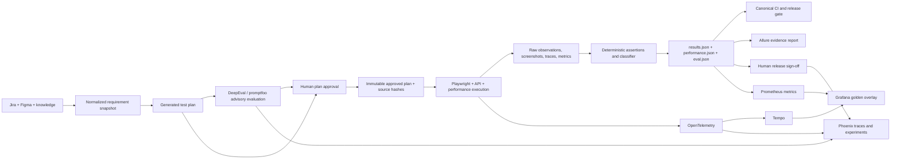

# Test Output Evaluation Platform

Status: Proposed  
Research date: 2026-09-30

## Purpose

This design defines how PR-UX Assurance should evaluate whether generated and
executed tests satisfy their acceptance criteria. It covers deterministic
browser evidence, Figma conformance, performance budgets, LLM-generated plans,
human review, and release sign-off.

The core rule is:

> Deterministic evidence owns the product verdict. LLM evaluation may explain,
> rank, or challenge a result, but it must not silently replace measured facts.

## Existing foundation

PR-UX already has the correct canonical building blocks:

- Versioned approved plans and source hashes in `agent/test_catalog.py`.
- Acceptance criteria, evidence, and verdict models in `agent/models.py`.
- Artifact, evidence, secret, gold-label, and performance checks in
  `agent/reporting/evaluate_run.py`.
- Browser screenshots and traces plus machine-readable `results.json`.
- Performance samples, distributions, budgets, and golden baselines under
  `agent/performance/`.
- Human approval through the test catalog and Excel projection.

External evaluation products should consume projections of this data. They
must not become the only store of plans, evidence, verdicts, or approvals.

## Product survey

| Product | Best capability | Self-hosting | Human review | Recommended use |
|---|---|---:|---:|---|
| [Arize Phoenix](https://arize.com/docs/phoenix) | OpenTelemetry traces, datasets, experiments, annotations | Yes | Yes | Primary open evaluation and trace hub |
| [DeepEval](https://deepeval.com/docs/evaluation-introduction) | Python/pytest LLM metrics and custom rubrics | Core is local | Limited in OSS | Planner, vision, and recommendation regression tests |
| [promptfoo](https://www.promptfoo.dev/docs/) | Declarative assertions, model matrices, red teaming | Yes | Basic | Optional model/provider comparison and adversarial testing |
| [Allure Report](https://allurereport.org/docs/) | CI evidence, attachments, test history | Yes | Report review | Immediate browser-test evidence portal |
| [Ragas](https://docs.ragas.io/) | Retrieval and RAG metrics | Yes | External | Existing RAG retrieval evaluation only |
| [Evidently](https://docs.evidentlyai.com/docs/library/overview) | Metric conditions and trend monitoring | Yes | Limited | Optional performance and quality trend analysis |
| [Braintrust](https://www.braintrust.dev/docs/evaluate) | Managed experiments and structured human review | Data plane | Strong | Preferred commercial pilot |
| [LangSmith](https://docs.langchain.com/langsmith/evaluation) | Managed tracing and offline/online evaluation | Enterprise | Strong | Alternative when LangChain ecosystem alignment matters |
| [Confident AI](https://deepeval.com/confident-ai) | Team datasets, annotation, and DeepEval operations | Enterprise | Strong | Alternative managed DeepEval workflow |
| [TruLens](https://www.trulens.org/) | OTEL-native feedback functions | Yes | Moderate | Not selected; overlaps Phoenix |
| [Giskard](https://docs.giskard.ai/) | Agent security and vulnerability scans | Core is local | Commercial | Later security/red-team extension |
| [ReportPortal](https://reportportal.io/docs/) | Large-scale automated failure triage | Yes | Defect triage | Revisit only at multi-repository scale |
| [OpenAI Evals](https://github.com/openai/evals) | Model benchmark harness | Yes | Weak | Not selected; narrower than DeepEval/promptfoo |

## Recommendation

Adopt a layered stack instead of selecting one universal evaluator:

1. **Existing PR-UX evaluator remains authoritative**
   - Deterministic assertions, evidence integrity, domain verdicts, performance
     budgets, and release gating.
2. **Allure provides the test evidence interface**
   - CI-friendly reports, screenshots, Playwright traces, history, retries, and
     links to raw artifacts.
3. **Phoenix provides the open evaluation and trace hub**
   - OpenTelemetry traces, datasets, experiments, code/LLM annotations, and
     reviewer feedback.
4. **DeepEval evaluates nondeterministic components**
   - Generated plans, visual observations, citations, and recommendations.
5. **promptfoo is optional**
   - Cross-provider comparisons, latency/cost limits, prompt injection, and
     adversarial test matrices.
6. **Ragas remains narrowly scoped**
   - Retrieval hit rate, recall, ranking, faithfulness, and citation quality.

Braintrust is the preferred commercial pilot if managed review assignments and
collaboration become more important than local-first operation.

## Target architecture



## Evaluation model

### 1. Deterministic acceptance evaluation

Every acceptance criterion must resolve to explicit evidence:

- Browser assertion result.
- Screenshot, DOM snapshot, network record, or Playwright trace.
- Figma frame comparison and threshold.
- API/database observation where permitted.
- Performance distribution and budget outcome.

Missing evidence is not a pass. A test result is valid only when its plan
version, source hashes, execution environment, and artifact manifest are
present.

### 2. Advisory model evaluation

Use DeepEval or promptfoo for outputs that are inherently nondeterministic:

- Acceptance-criteria coverage in generated scenarios.
- Unsupported or invented test steps.
- Citation correctness.
- Scenario executability and policy compliance.
- Precision of visual observations against human labels.
- Whether recommendations agree with deterministic verdicts.

Store judge model, prompt, rubric, temperature, and evaluator version with each
score. Borderline results require repeated trials or human review.

### 3. Human evaluation

Separate two approvals:

- **Plan approval:** authorizes execution of a versioned test plan.
- **Release sign-off:** accepts the evidence and release decision from a
  completed run.

The release sign-off record must include:

- Run, commit, plan, and environment identifiers.
- Hashes of `results.json`, `performance.json`, `eval.json`, and the artifact
  manifest.
- Reviewer identity, timestamp, decision, rationale, and any override.

Changing any bound artifact invalidates the sign-off.

## Canonical contracts

### Evaluation result

```json
{
  "evaluator": "planner-ac-coverage",
  "version": "1.0.0",
  "kind": "deterministic|llm_judge|human",
  "subject": {
    "run_id": "run-123",
    "story": "BLOG-105",
    "plan_version": 3
  },
  "score": 0.94,
  "threshold": 0.90,
  "passed": true,
  "evidence": ["artifacts/results.json"],
  "model": null,
  "rubric_hash": "sha256:...",
  "created_at": "2026-09-30T00:00:00Z"
}
```

### Verdict ownership

| Concern | Authority |
|---|---|
| Functional assertion | Existing deterministic executor |
| Figma conformance | Existing measured frame comparison |
| Performance regression | Performance budget and golden baseline |
| Evidence completeness | `evaluate_run.py` |
| LLM output quality | DeepEval/promptfoo advisory score |
| Release acceptance | Signed human decision plus deterministic gate |

External tools may display these outcomes but may not rewrite them.

## Phased implementation

### Phase 1: Allure evidence adapter

Add:

- `agent/reporting/allure.py`
- `tests/assurance/test_run_results.py`
- `allure-pytest` as an optional dependency

Map each acceptance criterion and Figma frame to an Allure test. Attach
screenshots, traces, network evidence, result JSON, evaluation JSON, and
performance summaries. Preserve `PASS`, `GAP`, `DEFECT`, and `RISK` as domain
labels even when projected into Allure's test states.

### Phase 2: Phoenix and OpenTelemetry

Add:

- `agent/telemetry.py`
- `agent/integrations/phoenix.py`
- Phoenix to the local observability Compose stack
- A second OTEL Collector exporter for Phoenix

Instrument:

- `assurance.run`
- `assurance.story`
- `assurance.scenario`
- `assurance.browser.step`
- `assurance.llm.plan`
- `assurance.llm.vision`
- `assurance.performance.profile`

Keep large artifacts in the existing artifact store and place links and stable
hashes on spans.

### Phase 3: DeepEval suites

Add:

- `evals/test_planner_quality.py`
- `evals/test_vision_quality.py`
- `evals/test_recommendation_quality.py`
- `evals/datasets/*.jsonl`
- `evals/judges/*.py`

Run deterministic metrics on every pull request. Run model-judge suites only
when prompts, models, retrieval, vision, or planner code changes.

### Phase 4: Signed release review

Add:

- `agent/review/signoff.py`
- `runs/<run-id>/signoff.json`

Phoenix may provide the review UI, but the signed local JSON record remains the
portable source of truth.

### Phase 5: Optional enterprise pilot

Export one fixed benchmark dataset to Braintrust, LangSmith, and Confident AI.
Compare review workflow, security, data retention, CI support, pricing, and
round-trip export before selecting a managed platform.

## Guardrails

- Never allow an LLM judge alone to mark a release as passed.
- Do not use the same model and prompt configuration to generate and judge
  output without an independently labeled calibration dataset.
- Pin judge model and rubric versions; repeat borderline evaluations.
- Hash source snapshots, plans, outputs, evidence, and sign-off records.
- Redact cookies, headers, passwords, storage state, DOM inputs, and screenshots
  before exporting traces or evidence.
- Keep raw URLs, story text, user identifiers, and trace IDs out of metric
  labels to control cardinality and exposure.
- Keep performance runs separate from screenshot-heavy functional runs.
- Default Allure and Phoenix to local deployment. SaaS export must be explicitly
  enabled.
- Preserve portable formats: JSON/JSONL, OTLP, JUnit/Allure attachments, and
  ordinary artifact files.
- Human overrides require identity, rationale, scope, and expiry and never
  rewrite measured verdicts.

## Decision

The recommended initial implementation is:

**PR-UX deterministic evaluator + Allure + Phoenix + DeepEval**

This combination provides trustworthy release gates, useful test evidence,
open observability, experiment tracking, and targeted LLM evaluation without
making a commercial platform or an LLM judge the system of record.

## Official references

- [DeepEval evaluation](https://deepeval.com/docs/evaluation-introduction)
- [DeepEval CI/CD](https://deepeval.com/docs/evaluation-unit-testing-in-ci-cd)
- [promptfoo assertions](https://www.promptfoo.dev/docs/configuration/expected-outputs/)
- [promptfoo CI/CD](https://www.promptfoo.dev/docs/integrations/ci-cd/)
- [Ragas experiments](https://docs.ragas.io/en/latest/concepts/experimentation/)
- [Phoenix datasets and experiments](https://arize.com/docs/phoenix/datasets-and-experiments)
- [Phoenix annotations](https://arize.com/docs/phoenix/tracing/how-to-tracing/feedback-and-annotations/capture-feedback)
- [Phoenix self-hosting](https://arize.com/docs/phoenix/self-hosting)
- [LangSmith evaluation](https://docs.langchain.com/langsmith/evaluation)
- [Braintrust evaluation](https://www.braintrust.dev/docs/evaluate)
- [Braintrust human review](https://www.braintrust.dev/docs/annotate/human-review)
- [TruLens OpenTelemetry](https://www.trulens.org/otel/)
- [Giskard evaluations](https://docs.giskard.ai/hub/sdk/guides/evaluations)
- [Evidently library](https://docs.evidentlyai.com/docs/library/overview)
- [Allure attachments](https://allurereport.org/docs/attachments/)
- [Allure history and retries](https://allurereport.org/docs/history-and-retries/)
- [ReportPortal documentation](https://reportportal.io/docs/)
