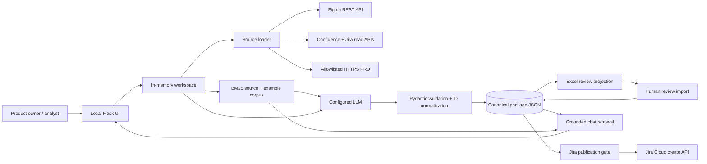

# Requirements Alchemist — Architecture and detailed design

**Author:** Vivek
**Related PRD:** `docs/prd/003-requirements-alchemist.md`

## 1. Context

Requirements Alchemist is a separate Flask application inside the assurance repository. It
creates candidate Jira stories upstream of the existing PR/UX assurance lifecycle. Its
canonical output is structured JSON; the browser, Excel workbook, Jira issues, and chat
responses are controlled projections of that state.

The application is intentionally modular:

| Module | Responsibility |
|---|---|
| `config.py` | JSON/environment configuration and secret-name indirection |
| `models.py` | strict source, criterion, story, package, input, and publish contracts |
| `sources.py` | read-only Figma, Confluence, Jira, PRD URL, and text acquisition |
| `retrieval.py` | chunking, local BM25 retrieval, and approved-reference persistence |
| `generation.py` | provider-neutral LLM calls, generation policy, normalization, chat |
| `outputs.py` | canonical JSON, safe Excel projection/import, Jira ADF publication |
| `app.py` | local workspace orchestration and HTTP API |
| `templates/index.html` | escaped browser workflow and chat experience |

## 2. Runtime view

## 3. Trust boundaries

1. **Browser boundary:** all mutation calls require a session CSRF token. The default server
   listens only on loopback.
2. **Source boundary:** remote text is untrusted data. It is size-limited, HTML-stripped,
   stored as evidence, and never executed.
3. **LLM boundary:** source text can contain prompt injection. The system instruction defines
   source content as evidence rather than instructions, and output must validate against a
   closed schema.
4. **Spreadsheet boundary:** workbook input is untrusted. Formula-like and credential-like
   values are rejected. Only review fields are accepted.
5. **Jira write boundary:** write access is disabled by default and requires configuration,
   credentials, story approval, and an explicit user action.
6. **Reference boundary:** bundled examples and approved stories guide structure only. Their
   metadata records provenance and license.

## 4. Data model

### SourceDocument

`id`, `kind`, `title`, `text`, optional `url`, and metadata. Source IDs are stable for remote
systems (for example `jira-PROJ-123`) or content-derived for pasted text.

### StoryPackage

The aggregate root includes package-level requirements and a list of `GeneratedStory` values.
All persistence and publication starts from this validated object.

### GeneratedStory

The story contract separates:

- intent: persona, capability, benefit, narrative, business value;
- boundary: in/out scope, dependencies, assumptions, risks, questions;
- behavior: typed Given/When/Then criteria;
- quality: categorized measurable NFRs;
- delivery: UX, data, analytics, tests, DoR, DoD, priority, labels, estimate;
- traceability: citations and criterion source IDs; and
- governance: review state, reviewer/comment, Jira key.

## 5. Source adapter design

`SourceLoader.load_url` classifies a URL:

1. validate HTTPS, hostname, allowlist, and resolved public IP;
2. dispatch Figma URLs to the Figma adapter;
3. dispatch configured Atlassian Jira/Confluence paths to those adapters;
4. otherwise fetch an allowlisted PRD page without redirects.

Figma converts the document node tree to bounded textual evidence. Confluence converts storage
HTML to text. Jira converts ADF to text. No adapter performs writes.

For production, adapters should implement a shared protocol and add response-byte streaming
limits, retries with jitter, explicit rate-limit handling, OAuth, source snapshots, and
connector-specific telemetry.

## 6. Retrieval design

The current corpus uses the repository's deterministic BM25 implementation:

1. source/reference text is normalized;
2. text is split into approximately 1,600-character chunks with 240-character overlap;
3. each chunk retains source and license metadata;
4. BM25 ranks chunks for generation guidance and each chat turn.

This choice is free, offline, inspectable, and adequate for a small corpus. It avoids requiring
an embedding model for the foundation. A future hybrid adapter can add local or hosted
embeddings and reciprocal-rank fusion while retaining the same `RetrievedChunk` contract.

Approved stories are persisted under `reference_data/user/`. They are excluded from product
evidence citations and are accepted only when the canonical status is `APPROVED`.

## 7. Generation pipeline

1. Validate `GenerationInput`.
2. Add optional pasted text and linked sources.
3. Build a retrieval query from title, objective, and source titles.
4. Retrieve licensed/provenanced exemplary chunks.
5. send system policy, product evidence, examples, and JSON schema to the model;
6. parse with `StoryPackage.model_validate_json`;
7. normalize package/story/criterion IDs;
8. force review state to DRAFT and clear Jira keys;
9. filter package, criterion, and citation IDs against valid product source IDs;
10. save canonical JSON; and
11. rebuild the chat corpus with generated stories.

Replay mode creates a deliberately low-confidence example to exercise the complete workflow
without presenting it as a production-quality generation.

## 8. LLM providers

| Provider | Client behavior | Intended use |
|---|---|---|
| `replay` | no network; deterministic illustrative package/chat notice | demos and workflow tests |
| `openai-compatible` | `OpenAI` client with configurable base URL and environment key | OpenAI, Ollama, vLLM, compatible services |
| `azure` | `AzureOpenAI`, deployment from environment | Azure-hosted enterprise use |

Generation requests JSON-object mode. Compatibility depends on the selected endpoint/model.
The schema validation step remains mandatory. Provider errors fail the operation without
publishing partial stories.

## 9. Excel integrity model

Excel is intentionally a projection:

- exported story content helps reviewers inspect the package;
- the Human Review sheet carries the only accepted mutations;
- package ID binds the workbook to canonical JSON;
- exact review headers prevent hidden/unknown review columns;
- macro-free `.xlsx`, size limit, and formula/credential checks reduce file risk.

If editable story content is needed later, use field-level change proposals with a visible
diff and explicit merge rather than directly trusting cells.

## 10. Jira publication model

Each approved unpublished story maps to Jira Cloud:

- project and issue type from configuration;
- title to summary;
- narrative, value, description, criteria, questions, and citations to ADF description;
- generated and configured labels to labels;
- package/local IDs and publication time to an issue property.

Results are per story, so one failure does not conceal successful writes. On success the Jira
key is persisted immediately after the operation returns. For stronger production
idempotency, query issue properties before create and use an outbox/idempotency store.

## 11. Chat design

For each question:

1. BM25 retrieves the most relevant source/reference/generated-story chunks;
2. the bounded last eight conversation messages and retrieved chunks are sent to the model;
3. policy requires source-ID citations and separates facts from recommendations;
4. response and source IDs return to the browser;
5. only the last sixteen messages remain in memory.

Chat never calls Jira tools and cannot approve or publish stories.

## 12. Web API

| Method/path | Purpose |
|---|---|
| `GET /api/state` | current evidence/package projection |
| `POST /api/sources/text` | add pasted PRD |
| `POST /api/sources/upload` | add approved text file |
| `POST /api/sources/url` | ingest validated remote source |
| `DELETE /api/sources/{id}` | remove session source |
| `POST /api/generate` | generate and persist a DRAFT package |
| `PATCH /api/stories/{id}/review` | update human review metadata |
| `POST /api/stories/{id}/reference` | promote an APPROVED story to local RAG |
| `GET /api/export/excel` | download review workbook |
| `GET /api/export/assurance` | download approved stories in assurance-agent JSON |
| `POST /api/review/import` | import Human Review sheet |
| `POST /api/publish/jira` | publish approved stories when enabled |
| `POST /api/chat` | grounded requirements question |
| `POST /api/workspace/reset` | clear ephemeral workspace |

## 13. Deployment boundary

The implemented app is a trusted single-user local tool. Before shared or production hosting,
add:

- SSO and role-based permissions;
- encrypted database/blob storage and tenant isolation;
- durable session/workspace IDs;
- background jobs with cancellation and retry;
- malware/content scanning;
- outbound egress policy;
- OAuth connector credentials in a secret manager;
- structured audit events and redacted telemetry;
- rate limiting and quotas;
- remote idempotency checks; and
- backup, retention, and deletion controls.

## 14. Test strategy

Focused automated tests verify:

- licensed sample retrieval;
- strict story/package contracts;
- Excel review isolation;
- ADF criterion mapping;
- approval-gated Jira behavior; and
- end-to-end replay-mode source, generation, persistence, and review.

Production acceptance should add contract tests against Atlassian/Figma sandboxes, adversarial
prompt/SSRF/workbook tests, model evaluation against a human-labeled requirements corpus,
accessibility testing, load testing, and publication rollback/incident exercises.
