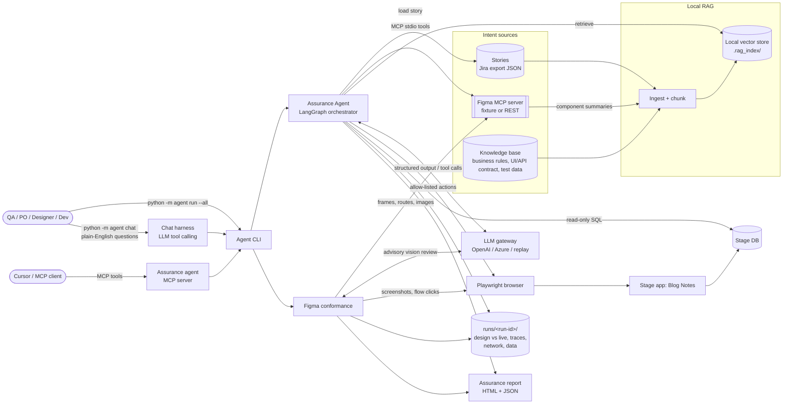
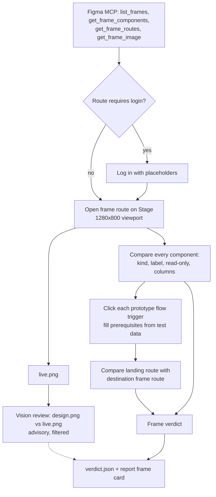
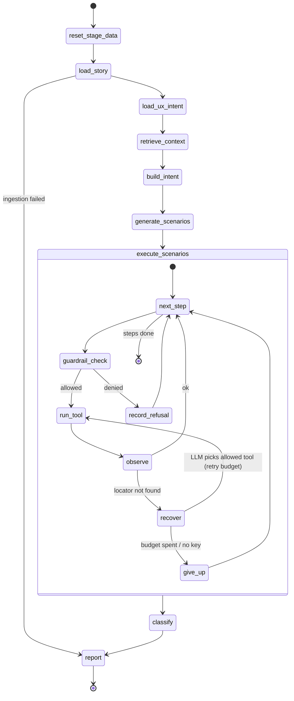
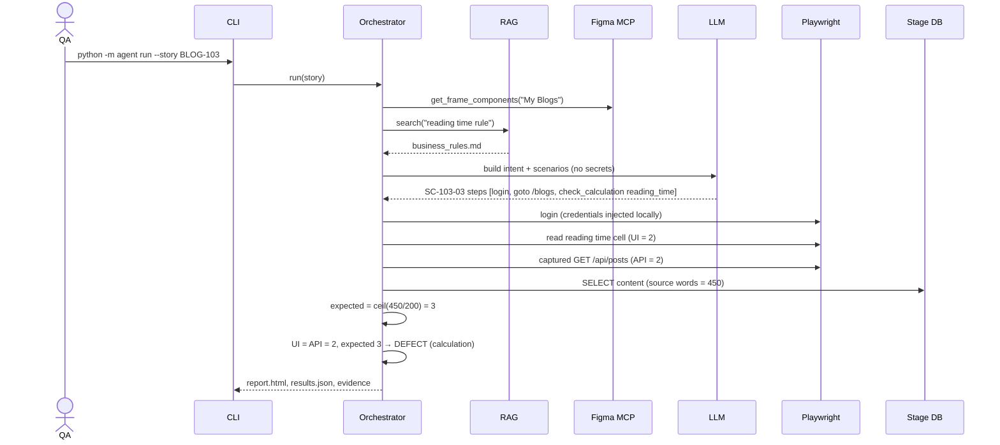

# Architecture: Stage Requirement & UX Assurance Agent

**Author:** Vivek Kaushik · Implements [PRD-001](../prd/001-stage-requirement-assurance-agent.md).

## 1. System context



## 2. Components

| Component | Responsibility | Folder |
|---|---|---|
| Product intent | Stories, ACs, business rules (Jira export adapter) | `stories/`, `agent/sources/jira.py` |
| UX intent | Frames, components with positions, flows, routes, approved variances, frame images | `mcp_servers/figma_mock/`, `agent/sources/figma_client.py` |
| Engineering context | Business rules, UI/API contract, controlled test data, glossary | `knowledge_base/` |
| RAG and intent model | Local vector store; expected-behavior record per story | `rag/`, `agent/intent_builder.py` |
| Chat harness | Conversational front end: the LLM picks tools (list/show stories, show design, run conformance, run stories, read results, search knowledge, open report); answers cite tool results only | `agent/chat.py`, `llm/prompts/chat_system.md` |
| Orchestrator | LangGraph state graph per story | `agent/orchestrator.py` |
| Figma conformance | Per-frame design vs live verdict | `agent/conformance.py` |
| Execution layer | Browser, read-only data, Figma compare tools | `agent/tools/` |
| Validation and classification | Deterministic checks and label rules | `agent/executor.py`, `agent/classifier.py` |
| Evidence | Per-run evidence store | `runs/<run-id>/` |
| Reporting | HTML and JSON report | `agent/reporting/` |

## 3. Figma conformance flow (one frame)



Frame verdict rules:

| Observation | Label |
|---|---|
| Flow lands on a different route than the design | DEFECT |
| Component missing, wrong control type or wrong label (not an approved variance) | GAP |
| Flow trigger missing | GAP |
| Screen unreachable (login failed, navigation error) | RISK |
| Everything matches, or differs only by approved variances | PASS |

Components marked `State=Conditional` in Figma (for example error messages) are reported as `skipped`, not missing. Flows that lead to Login (logout) run last so they do not end the session early. The vision review never changes the label; notes about conditional states or approved variances are filtered out.

## 4. Orchestrator graph (one story)



**Where the LLM is used (and where it is not):**

| Node | LLM? | Why |
|---|---|---|
| Chat harness | Yes | Choose which checks to run for a question and explain the tool results |
| build_intent | Yes | Normalize ACs into actor / precondition / action / expected; flag ambiguity |
| generate_scenarios | Yes | Derive AC-tagged scenarios in a constrained step language |
| execute_scenarios / recover | Yes, only on failure | Choose one allow-listed tool given a page snapshot |
| Conformance visual review | Yes (vision model), advisory | Spot layout and style drift the component check cannot see |
| Validation (text, URL, calculation, Figma compare, flows) | **No** | Deterministic checks stay deterministic |
| classify | Rules; LLM only writes the recommendation | Labels come from evidence, not model opinion |

## 5. Sequence: BLOG-103 (calculation defect)



## 6. Folder structure

```
PR-UX-assurance-agent/
├── README.md
├── docs/
│   ├── prd/001-stage-requirement-assurance-agent.md   # WHAT and WHY
│   └── architecture/architecture.md                   # HOW (this file)
│
├── stories/                 # Product intent: Jira stories (BLOG-101..105)
├── knowledge_base/          # Engineering context: rules, UI/API contract, test data, flow test data
│
├── stage_app/               # Stage application under test (Flask + SQLite)
│   ├── app.py               #   routes and JSON API
│   ├── db.py / seed.py      #   schema + deterministic seed
│   └── templates/, static/
│
├── mcp_servers/
│   ├── figma_mock/          # MCP server exposing Figma-shaped UX intent
│   │   ├── server.py        #   FastMCP tools (stdio)
│   │   ├── figma_parser.py  #   Figma REST JSON → components with boxes, flows, routes
│   │   ├── render_frames.py #   renders frame PNGs for the fixture
│   │   └── fixtures/        #   blog_notes.figma.json, frames/*.png
│   └── assurance_agent/     # The agent exposed as MCP tools
│
├── rag/                     # Local RAG (no external DB)
│   ├── embeddings.py        #   OpenAI embeddings or offline hashing embedder
│   ├── store.py             #   numpy vector store persisted to .rag_index/
│   ├── ingest.py            #   chunk stories, knowledge base, Figma summaries
│   └── retriever.py
│
├── llm/                     # LLM gateway (provider-agnostic)
│   ├── client.py            #   OpenAI / Azure / replay; text and vision; token accounting
│   ├── prompts/             #   prompt templates
│   └── replay/              #   recorded model outputs
│
├── agent/                   # The assurance agent
│   ├── cli.py / __main__.py #   entry point: `python -m agent ...`
│   ├── config.py            #   env-driven settings
│   ├── models.py            #   Pydantic: Story, Intent, Scenario, Step, verdicts
│   ├── sources/             #   jira.py, figma_client.py (MCP client)
│   ├── intent_builder.py
│   ├── scenario_generator.py
│   ├── orchestrator.py      #   LangGraph graph
│   ├── conformance.py       #   per-frame Figma conformance
│   ├── executor.py          #   step execution, guardrails, recovery
│   ├── guardrails.py        #   allow-list, environment boundary, secret masking
│   ├── tools/               #   browser.py, data.py, figma_compare.py
│   ├── classifier.py
│   └── reporting/           #   report.py + templates/report.html.j2
│
├── evals/                   # Gold labels + evaluation runner
├── tests/                   # Unit and integration tests
└── runs/                    # Output per run (gitignored)
```

## 7. Contracts

### 7.1 Scenario step language (what the LLM may emit)

| Action | Args | Deterministic check |
|---|---|---|
| `goto` | `path` | URL stays under `STAGE_BASE_URL` |
| `fill` | `target`, `value` | value may use `${STAGE_USER}` / `${STAGE_PASSWORD}` / `${TODAY}` placeholders |
| `click` | `target` | refused if target matches destructive terms |
| `select` | `target`, `values[]` | multi-value on single-select → capability gap |
| `expect_visible` / `expect_hidden` | `target` | element state |
| `expect_text` | `target`, `text` | element contains text |
| `expect_value` | `target`, `text` | field value (element text for non-fields) |
| `expect_readonly` | `target` | field is not editable |
| `expect_url` | `contains` | current URL |
| `expect_rows` | `values[]` | complete set of listed titles |
| `check_calculation` | `name` (`word_count`, `reading_time`) | UI vs API vs rule vs DB |
| `figma_check` | `frame`, `values[]` | components, labels, control types |
| `measure_load` | `path` | records ms; never decides PASS alone |
| `screenshot` | `name` | evidence |

Targets: `{"role": "button", "name": "Log in"}`, `{"label": "Username"}`, `{"text": "..."}`, `{"testid": "..."}`. The browser tool tries the planned target first, then equivalent forms of the same name (label, button, link, heading, text), then approved-variance labels. How the target resolved is recorded in the step detail.

### 7.2 Figma MCP tools

| Tool | Returns |
|---|---|
| `get_file_info()` | file name, version, last modified |
| `list_frames()` | frame id, name, size |
| `get_frame_components(frame)` | node id, kind, label, required, box (relative to frame), columns |
| `get_prototype_flows()` | from frame, trigger label, to frame |
| `get_approved_variances()` | component, allowed labels or kinds, reason |
| `get_story_frames(story_key)` | frames linked to a Jira key |
| `get_frame_routes()` | Stage route per frame and whether login is required |
| `get_frame_image(frame)` | local PNG path and size (fixture or `GET /v1/images/:key`) |

Source switch: `FIGMA_SOURCE=fixture` (default) or `FIGMA_SOURCE=rest` with `FIGMA_TOKEN` + `FIGMA_FILE_KEY`. The fixture uses the same JSON shape as `GET /v1/files/:key`, so one parser serves both.

### 7.3 LLM gateway

`LLM_PROVIDER=openai | azure | replay`. Calls go through `LLM.structured(...)`, `LLM.vision(...)` or `LLM.choose_tool(...)`. `OPENAI_MODEL` (default `gpt-4o-mini`) plans; `VISION_MODEL` (default `gpt-4o`) reviews screenshots. The gateway records task, model and tokens per call. Replay reads `llm/replay/<task>/<key>.json`.

### 7.4 Outputs

| Artifact | Consumer | Content |
|---|---|---|
| `report.html` | Humans | Conformance summary, frame cards (design vs live, highlighted components, components and flows tables, visual review), story and AC verdicts with evidence links |
| `results.json` | CI, dashboards | `meta`, `figma_conformance[]`, `stories[]` |
| `figma/<slug>/` | Designers, developers | `design.png`, `live.png`, `verdict.json`, `trace.zip`, `network.json` |
| `<story>/<scenario>/` | Developers | Step screenshots, `trace.zip`, `network.json`, calculation files |

## 8. Guardrails and data handling

| Concern | Control |
|---|---|
| Destructive actions | `guardrails.py` denies click/goto targets matching delete/remove/drop/admin/reset; refusal becomes evidence and blocks PASS |
| Environment boundary | Navigation limited to `STAGE_BASE_URL`; DB opened read-only (`mode=ro`) |
| Secrets and PII | Placeholders resolved only in the browser tool; evidence, network logs and traces masked; page snapshots sent to the LLM exclude input values |
| Hallucinated requirements | Intent built first and saved; scenarios must cite AC IDs present in the intent |
| Vision false positives | Advisory only; conditional and approved-variance notes filtered |
| Cost | Token counter per run and per task; retry budget per step (`MAX_RECOVERY_ATTEMPTS`) |

## 9. Classification rules (per AC)

From the step results of all scenarios that cite the AC:

1. Guardrail refusal, execution error, incomplete evidence, or locator found only by LLM recovery → **RISK**
2. AC flagged ambiguous in intent → **RISK**
3. Expected element or capability missing (including Figma component missing) → **GAP**
4. Check executed and contradicted (text, URL, calculation mismatch) → **DEFECT**
5. All checks passed and evidence present → **PASS**

Precedence: DEFECT > GAP > RISK > PASS. Story label = highest-precedence AC label.

## 10. Key decisions and trade-offs

| Decision | Chosen | Alternative | Why |
|---|---|---|---|
| Orchestration | LangGraph state graph | Single prompt | Visible state, retry edges, inspectable run |
| Vector store | numpy + JSON on disk | Chroma, FAISS | No native dependencies on Windows / Python 3.14; small corpus |
| Embeddings | OpenAI `text-embedding-3-small`; offline hashing fallback | sentence-transformers | No GPU; avoids torch install |
| Figma source | MCP server over Figma-REST-shaped JSON | Official Figma Dev Mode MCP | No paid seat required; deterministic; switches to REST |
| Jira | JSON export | Jira Cloud API | Deterministic; adapter boundary allows swap |
| Design conformance | Semantic component + flow checks decide; vision review advises | Pixel diff or LLM judge | Tolerates dynamic content and approved variances; reproducible labels |
| Vision model | gpt-4o | gpt-4o-mini | Fewer false positives and about 25x fewer image tokens in practice |
| Keyless mode | Replay provider | none | Repeatable evaluations at zero cost |
