# PR-UX Assurance Agent — Complete Design Reference

Project structure, architecture, every component with its inputs, outputs and errors, data model, configuration, CLI and MCP surfaces, processing flows, performance assurance, advisory evaluation, guardrails, and evaluation. Author: Vivek Kaushik. Repository: github.com/vivekk1010/PRUX-assurance-agent, branch `feature/pluggable-assurance-platform` (package version 0.1.0).

## 1. Purpose and scope

The PR-UX Assurance Agent answers one release question with evidence: **does the StageUI build match its Jira story and its Figma design, and is it fast enough?**

It reads Jira-style stories and a Figma design (the design through a read-only MCP server), grounds every plan in a local hybrid RAG index, generates versioned test plans with an Excel review projection, runs only human-approved tests in a guarded Playwright browser, and classifies every acceptance criterion and every design frame with deterministic rules. Configurable performance profiles measure pages, features and components with repeated cold and warm runs, statistics, budgets and approved baselines. An optional, non-authoritative DeepEval judge scores the quality of the written recommendations. Each run ends with an HTML report, a machine-readable `results.json`, and an `eval.json` artifact audit.

| Label | Meaning | Typical cause |
|---|---|---|
| **PASS** | Implementation matches the story and the design | All checks pass; differences are approved variances only |
| **GAP** | Something the story or design asks for is missing or different | Missing component, wrong control type, missing flow trigger |
| **DEFECT** | Implemented but behaves wrongly | Wrong calculation, wrong navigation, wrong data |
| **RISK** | Cannot be verified with confidence | Unmeasurable AC, login failure, guardrail refusal, locator found only by recovery |

Precedence when several findings apply to one criterion: **DEFECT > GAP > RISK > PASS**. Labels come only from `agent/classifier.py` and `agent/conformance.py`. A language model may plan, recover a locator, recommend, explain or score a recommendation, but never assigns a label. Performance has its own status vocabulary (PASS, WARN, FAIL, UNSTABLE, NOT_MEASURED, §12) and never changes an acceptance-criterion label.

**In scope:** Jira-shaped story files, Figma (fixture or REST), any browser-reachable web app through target adapters, OpenAI / Azure OpenAI / OpenAI-compatible / keyless replay models, Playwright performance measurement with optional k6, Lighthouse CI, BenchmarkDotNet import, Prometheus and OpenTelemetry export.
**Out of scope:** autonomous approval, Jira or Figma mutation, unrestricted computer use, verdicts produced by a model, destructive or production testing, load generation without an explicit k6 profile.

The repository also carries a copy of the Requirements Alchemist story generator (`requirements_alchemist/`). It is a separate product with its own repository and design reference; §5.28 only describes how it sits in this repository.

## 2. Quick start

```powershell
cd C:\Scaler\Cohort\PR-UX-assurance-agent
py -3.14 -m venv .venv
.venv\Scripts\activate
pip install -r requirements.txt
python -m playwright install chromium
copy .env.example .env          # set STAGE_PASSWORD; OPENAI_API_KEY is optional (replay mode without it)

python -m agent ingest                      # build the local RAG index (reads Figma through MCP)
python -m agent run --all --start-stage     # conformance for every frame + assurance for every story
start runs\<run-id>\report.html
```

Governed workflow and performance:

```powershell
python -m agent generate --story BLOG-104 --excel          # draft plan + review workbook, no browser
# review test_plans\BLOG-104\v1.xlsx (approve / reject / edit steps)
python -m agent review import --story BLOG-104 --file test_plans\BLOG-104\v1.xlsx
python -m agent run-approved --story BLOG-104 --start-stage

python -m agent performance list
python -m agent performance run --start-stage --profile blogs-page --profile tag-filter-feature
python -m agent performance promote --run <run-id> --profile blogs-page --approved-by "<name>"
```

Python 3.10+ (tested with 3.14). No GPU. Dependencies: flask, playwright, pydantic 2, openai, mcp (>=1.9,<2), langgraph, numpy, jinja2, python-dotenv, httpx, pytest, openpyxl. Optional: `requirements-evaluation.txt` adds `deepeval>=3.7,<4` for the advisory judge; k6, `lhci` and Docker are only needed for the matching integrations.

## 3. Project structure

```
PR-UX-assurance-agent/
├── README.md, pyproject.toml, requirements.txt, requirements-evaluation.txt
├── .env.example                  Every setting with safe defaults; secrets left blank
├── .gitignore                    .env, *Key.txt, .rag_index/, runs/, test_plans/, archives (except the demo),
│                                 .requirements-alchemist/, generated_stories/
├── DemoCapstoneProject.7z        Demo video archive
├── agent/
│   ├── __main__.py               UTF-8 console, then cli.main
│   ├── cli.py                    All commands; run_stories; stage_session; run-approved; performance
│   ├── config.py                 Settings dataclass from environment (.env)
│   ├── models.py                 Pydantic contracts (Story, UXIntent, Step, TestPlan, verdicts...)
│   ├── orchestrator.py           LangGraph StateGraph per story; generate / execute test plans
│   ├── intent_builder.py         RAG context, citations, conflicts, ambiguity, IntentModel
│   ├── scenario_generator.py     IntentModel -> ScenarioPlan, with normalization rules
│   ├── executor.py               Guarded step loop + bounded LLM locator recovery
│   ├── classifier.py             Step evidence -> per-AC label (rules only)
│   ├── conformance.py            Per-frame Figma conformance and verdict
│   ├── guardrails.py             Step allow-list, origin/destructive checks, masking, trace scrub
│   ├── test_catalog.py           Immutable versioned plans, selection, staleness
│   ├── excel_io.py               Review workbook export, secure import, Results/Evaluation/Performance sheets
│   ├── tool_registry.py          Config-driven, authorization-aware tool registry
│   ├── mcp_tool_client.py        stdio / SSE / streamable-HTTP MCP invocation
│   ├── chat.py                   Plain-English chat harness over registry tools
│   ├── adapters/                 base.py (protocol + BaseAdapter), stageui.py, generic_web.py
│   ├── performance/              models, profiles, playwright_collector, statistics, baselines,
│   │                             integrations (k6, Lighthouse CI, BenchmarkDotNet), exporters, runner
│   ├── evaluation/               advisory DeepEval G-Eval judge: config, models, geval, runner, exporters
│   ├── sources/                  jira.py (story files), figma_client.py (MCP)
│   ├── tools/                    browser.py (Playwright), data.py (read-only DB, calculations), figma_compare.py
│   ├── reporting/                report.py, evaluate_run.py, templates/report.html.j2
│   └── plugins/sample.py         Example python-handler tool
├── llm/                          client.py (gateway), prompts/*.md, replay/generate_scenarios/BLOG-101..105.json
├── rag/                          ingest.py, embeddings.py, lexical.py (BM25), store.py, retriever.py, freshness.py
├── mcp_servers/
│   ├── figma_mock/               server.py (9 tools), figma_parser.py, render_frames.py, fixtures/
│   └── assurance_agent/server.py The platform as MCP (11 tools)
├── stageui_app/                  "Blog Notes" app under test (Flask + SQLite) with 3 seeded issues
├── stories/BLOG-101..105.json    Jira-shaped stories with acceptance criteria
├── knowledge_base/               business_rules.md, api_contract.md, test_data.md, glossary.md, flow_test_data.json
├── config/                       tools.json, apps/generic.example.json, performance.json, advisory-evaluation.json,
│                                 requirements-alchemist.json, requirements-alchemist.ollama.json
├── observability/                Prometheus, Tempo, OpenTelemetry Collector, Grafana (docker compose, loopback)
├── prototype/                    Static performance-workflow prototype (index.html, app.js, fixtures)
├── requirements_alchemist/       Bundled story generator (§5.28)
├── scripts/                      run-requirements-alchemist-ollama.ps1 / .sh
├── evals/                        gold_labels.json, run_eval.py, retrieval_gold.json, run_retrieval_eval.py
├── tests/                        18 test modules, 87 test functions (90 cases)
└── docs/
    ├── prd/                      001 StageUI agent, 002 pluggable platform, 003 Requirements Alchemist
    ├── architecture/             architecture.md, 002 pluggable platform, 003 output evaluation, 004 Alchemist
    ├── enhancements/             001 local advisory output evaluation
    ├── diagrams/                 performance-assurance-architecture.svg, requirements-alchemist-flow.md
    ├── demo/                     requirements-alchemist-video-guide.md
    └── design/                   this reference (.md/.pdf), build_docs.py, render_pdf.py, assets/
```

Runtime folders (gitignored): `.rag_index/`, `.figma_cache/`, `runs/<run-id>/`, `test_plans/<story>/`, `stageui_app/instance/blog.db`, `evals/results/`, `.requirements-alchemist/`, `generated_stories/`. Approved performance baselines (`performance-baselines/<profile>/`) are not ignored: they are reviewed artifacts meant to be versioned with the code.

## 4. Architecture overview

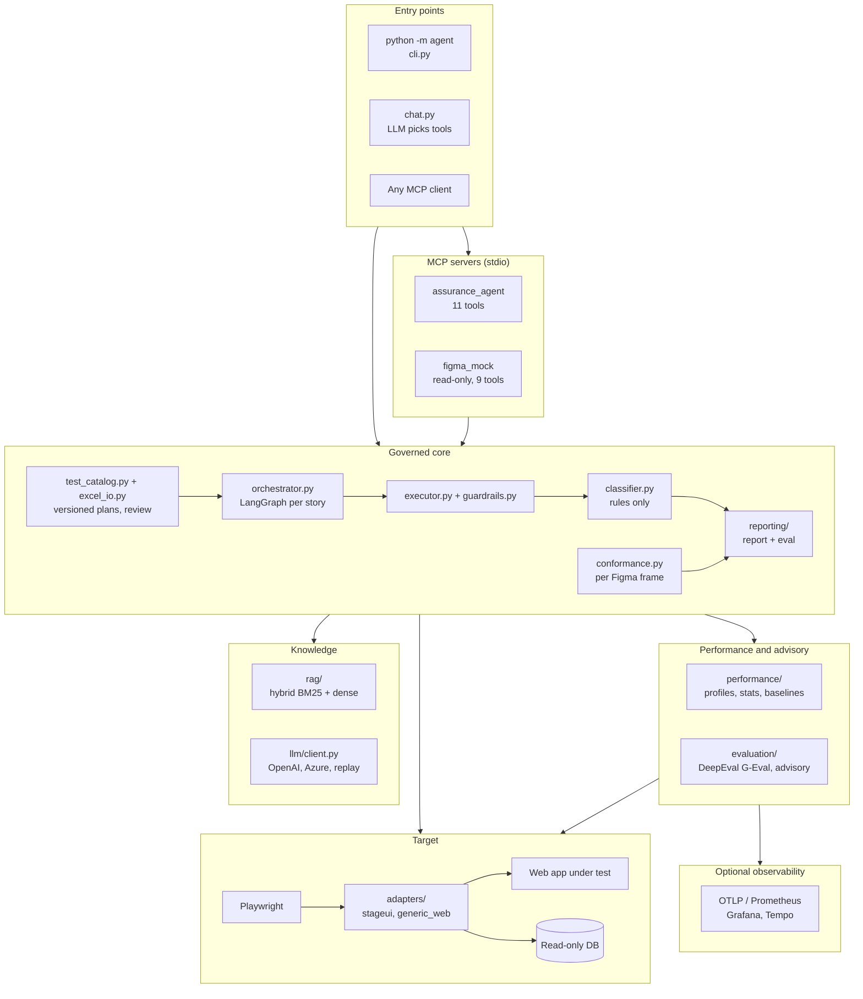

Figure: Layered architecture — three entry points share one governed core; models sit beside the core, never between the core and the verdict. Performance measurement reuses the adapters and browser; the advisory judge reads finished results only.

Design principles:

- **Probabilistic planning, deterministic judgement.** Models retrieve, plan, recover locators, explain and score; code validates approval, enforces browser policy, collects evidence, classifies, computes statistics and audits.
- **JSON is canonical.** Test plans, performance baselines and results are JSON; Excel is a validated review projection; Grafana is a view, not the source of truth.
- **Fail closed.** Missing ACs, stale plans, unknown tools, off-origin navigation, missing evidence, missing baselines (when required) and unstable measurements stop, downgrade to RISK, or fail the gate.
- **Secrets live only at the browser boundary.** Placeholders such as `${STAGE_PASSWORD}` are resolved inside the browser session (or passed to k6 through its environment) and masked everywhere else, including inside Playwright traces.
- **Offline by default.** Fixture Jira, fixture Figma, hashing embeddings and replay LLM give repeatable keyless runs; performance, the advisory judge and observability are disabled until configured.

## 5. Component reference

### 5.1 `agent/config.py` — settings

`Settings` is a dataclass whose defaults are read from the environment after `load_dotenv(ROOT/.env)`; `get_settings()` returns a fresh instance. `ROOT` is the repository root. The provider default is `azure` if `AZURE_OPENAI_API_KEY` is set, else `openai` if `OPENAI_API_KEY` is set, else `replay`. New `TARGET_*` names win over legacy `STAGE_*` names. Every field is listed in §9.

### 5.2 `agent/models.py` — contracts

Pydantic v2 models for stories, UX intent, intent, steps, scenarios, test plans, results and verdicts. Literal types: `Label` (PASS, GAP, DEFECT, RISK), `Check` (ui, api, data, calculation, figma, performance), `Action` (15 step actions, §6.3), `StepStatus` (ok, missing, mismatch, refused, error, recovered, skipped), `ReviewStatus` (DRAFT, APPROVED, REJECTED, NEEDS_CHANGE). Performance and advisory models live in their own packages (§6.5, §6.6).

### 5.3 `agent/cli.py` — commands and run pipelines

| Function | Input | Output / effect |
|---|---|---|
| `cmd_ingest(settings)` | stories, knowledge base, Figma UX via MCP | builds `.rag_index/` unless the manifest is fresh; prints chunk counts per source |
| `_retriever(settings)` | index directory | `Retriever`; builds the index if missing; warns when stale |
| `cmd_search`, `cmd_figma` | query / none | prints hits; prints frames, nodes, routes, images, variances |
| `stage_session(settings, start_stage)` | health URL | context manager yielding reachability; with `--start-stage` resets data and starts the adapter's app for the duration |
| `run_stories(settings, stories, reset, log, figma)` | story keys | `(run_dir, story_results, frame_verdicts)`; writes results, report, `eval.json`, optional `advisory-eval.json`, `runs/LATEST` |
| `cmd_run` | stories, flags | exit 0 if the eval passes, 3 if it fails, 2 if the target is unreachable |
| `cmd_generate(settings, stories, excel)` | story keys | new plan version per story (+ `.xlsx`); no browser |
| `cmd_review(action, story, file, version)` | workbook | `export` writes the workbook; `import` validates and stores review decisions |
| `cmd_plans(story)` | optional story | prints plan ids with status counts |
| `cmd_run_approved(story, frame, feature, ...)` | exactly one selector | executes approved cases only; stale plans refused unless `--allow-stale`; runs matching performance profiles when enabled and auto-run; advisory judge when enabled; adds Results, Evaluation and Performance sheets |
| `cmd_performance(action, ...)` | `list`, `run` or `promote` | lists profiles; measures profiles into a `<run-id>-perf` run with report and eval; promotes a passing summary to an approved baseline |
| `main(argv)` | CLI arguments | dispatch; refuses browser commands (including `performance run`) when form login is needed and no password is set (exit 2) |

### 5.4 `agent/orchestrator.py` — LangGraph story assurance

`AssuranceAgent(settings, run_dir, retriever, reset_stage=True, log=print)` compiles a `StateGraph(AssuranceState)` with nodes `reset_stage_data → load_story → load_ux_intent → retrieve_context → build_intent → generate_scenarios → execute_scenarios → classify → report`. `load_story` and `load_ux_intent` route to `report` on error (story label RISK, recommendation "Fix ingestion and re-run").

| Method | Input | Output |
|---|---|---|
| `run_story(key)` | story key | `StoryResult`; writes `<story>/intent.json`, `scenarios.json`, `result.json` |
| `generate_test_plan(key, catalog)` | story key, catalog | `(TestPlan, path)`; cases linked to features, frames, node ids, citations; source file hashes and the Figma version recorded |
| `execute_test_plan(plan)` | plan with approved cases | `StoryResult`; raises `ValueError` if nothing is approved |
| `mermaid()` | — | graph as Mermaid (`python -m agent graph`) |

Features come from the Figma file, then the target profile's `features`, then `TARGET_FEATURE_MAP`; later sources override by id. Staleness is detected from the recorded source-file hashes (`stories/`, `knowledge_base/`, fixtures) by `test_catalog.stale_sources`.

### 5.5 `agent/intent_builder.py` — grounded intent

| Function | Behaviour |
|---|---|
| `retrieve_context(story, retriever, k_per_query=3, limit=10)` | exact lookups for every `business_rules` id, then one filtered hybrid query for the title and one per AC (doc types business_rule, business_rule_group, api_contract, test_data, glossary, flow_test); de-duplicated, top 10 by score |
| `_grounding(story, hits)` | citations `C1..Cn`; conflict `missing_rule` (error) for referenced rules not retrieved; `rule_vs_story` (warning) when the story says ceil and a rule says floor or vice versa |
| `_checks_for(text)` | ui always; calculation+api+data for ceil/equals/count/minutes/calculat; figma for design/field/button/control/select; performance for load/fast/slow/seconds |
| `_ambiguity(text)` | vague words (fast, quick, intuitive, user-friendly, responsive, reasonable...) with no digit → ambiguous |
| `build_intent(story, ux, hits, llm)` | LLM `IntentModel` merged over the heuristic baseline (AC text kept, heuristic ambiguity never cleared); falls back to the heuristic intent when no key and no replay exists |

### 5.6 `agent/scenario_generator.py` — scenario planning

`generate_scenarios(intent, ux, retriever, llm)` retrieves per-AC context (adds api_contract for data checks, figma_frame and figma_variance for figma checks), asks the LLM for a `ScenarioPlan`, then normalizes it and returns `(plan, notes)`:

- drops scenarios citing unknown or no AC ids;
- removes `check_calculation` steps whose ACs do not mention the calculation;
- removes `expect_text`/`expect_value` steps that assert hard-coded numbers such as "3 min" (derived numbers belong to `check_calculation`);
- replaces targets whose label is a Figma kind (for example `error-text`) with a text target;
- adds a missing `check_calculation` (word_count or reading_time) to calculation ACs.

Without a key and without a recorded replay it returns an empty plan, which classifies every AC as RISK.

### 5.7 `agent/executor.py` — guarded execution and recovery

`run_scenario(settings, ux, llm, scenario, out_dir)` opens one `BrowserSession`, then for each step: skip if an earlier interactive step failed; refuse via `check_step`; execute; on a `not_found` interactive step, attempt recovery. Output: `ScenarioResult` with step results, trace and network paths, duration.

Recovery (`_recover`) runs up to `MAX_RECOVERY_ATTEMPTS` (default 2). The LLM sees the failed step, URL and a DOM snapshot of visible controls and may call only `click(role,name)`, `fill(label)`, `select(label)` or `give_up(reason)` from a registry restricted to surface `recovery`, capability `browser.recovery`, risk `low`. The proposed step passes guardrails again; success is recorded as `recovered`, which classifies as RISK.

### 5.8 `agent/tools/browser.py` — Playwright session

`BrowserSession(settings, ux, out_dir)` is a context manager: Chromium (headless unless `--headed`), viewport 1280×800, base URL and adapter context options (storage state or headers), tracing with screenshots and snapshots, and a listener that records `/api/` requests with status, timing and JSON body. On exit it writes `trace.zip` (scrubbed of secrets) and `network.json` (masked).

Locating: planned target first, then equivalent forms of the same visible name (label, button, link, heading, text), then approved variances (alternative labels or kinds); the resolution is recorded in the step detail. Every step writes a full-page `step-NN-<action>.png`.

| Action | Fields | Behaviour and statuses |
|---|---|---|
| `goto` | path | navigate, wait for network idle; HTTP ≥500 → error |
| `fill` | target, value | placeholders resolved at the boundary; missing → missing |
| `click` | target | click, settle |
| `select` | target, value or values | several values on a single-select → missing (capability) |
| `expect_visible` / `expect_hidden` | target | visible element; hidden element (visible → mismatch) |
| `expect_text` | text, optional target | polls page or element text; mismatch with actual |
| `expect_value` | target, text | input value, or element text for non-inputs |
| `expect_readonly` | target | editable → mismatch |
| `expect_url` | contains | polls current URL |
| `expect_rows` | values | opens the adapter list page and compares row titles as a set (needs `rows` capability) |
| `check_calculation` | name | adapter probe: UI vs API vs rule vs source (§5.10) |
| `figma_check` | frame, optional values | compares live components with the frame; writes `figma-<frame>.json`; problems → missing (GAP) |
| `measure_load` | path | wall time plus DOMContentLoaded and load from the Navigation Timing API; always ok, reported as a note |
| `screenshot` | name | evidence only |

### 5.9 `agent/tools/figma_compare.py` — semantic component comparison

`compare_frame(page, components, variances, only_labels=None)` returns one finding per component: `matched`, `approved_variance`, `missing`, `mismatch`, or `skipped` (conditional components such as error text). Locators by kind: buttons, links and headings by role and exact name; tables by role; text and error text by text; inputs by label. Control checks: multi-select must be `<select multiple>`, select must be `<select>`, password input must have `type=password`, text area must be `<textarea>`, read-only field must not be editable, tables must contain every designed column header.

### 5.10 `agent/tools/data.py` — read-only data and four-way calculation check

`ReadOnlyDB(path)` opens SQLite with `mode=ro` and accepts only one `SELECT` statement. `reconcile(name, ui_rows, api_posts, source_rows)` compares, per post, the UI value, the API value and the value computed by the business rule from source content:

| Calculation | Rule | UI test id | API field | Expected |
|---|---|---|---|---|
| `word_count` | BR-META-01 | `post-words` | `word_count` | whitespace-separated tokens |
| `reading_time` | BR-META-02 | `post-reading-time` | `reading_time_min` | `max(1, ceil(words / 200))` |

Findings: `source row missing (data issue)`, `API value breaks business rule (calculation issue)`, `UI differs from API (display issue)`, or `ok`. The result is written to `calculation-<name>.json`; any problem makes the step `mismatch` (DEFECT).

### 5.11 `agent/adapters/` — target adapters

`get_adapter(settings)` returns `StageUIAdapter` or `GenericWebAdapter` by `TARGET_ADAPTER`; anything else raises `ValueError`. The performance collector and the k6 script generator reuse `login_steps()` and `context_options()`.

| Member | `BaseAdapter` | `StageUIAdapter` | `GenericWebAdapter` |
|---|---|---|---|
| `login_steps()` | none | goto /login, fill Username, Password, click Log in | from profile `auth` when auth method is form |
| `reset()` | no-op | runs `stageui_app.seed` | no-op |
| `context_options()` | none | none | storage state file or extra HTTP headers; unknown method → `ValueError` |
| `secrets()` | password | password | password + header values + storage-state strings |
| `supports(cap)` | profile `capabilities` | form_auth, reset, rows, calculations, sqlite | form_auth when form, else profile |
| `health_url`, `allowed_origins` | profile or settings | same | same |
| `start_module`, `list_path`, `row_title_testid` | none, `/`, `row-title` | `stageui_app`, `/blogs`, `post-title` | profile values |
| `check_calculation` | error (RISK) | four-way probe (§5.10) | error (RISK) |

A missing `TARGET_PROFILE` file raises `FileNotFoundError`. Unsupported probes on generic targets become RISK rather than silently using StageUI behaviour.

### 5.12 `agent/guardrails.py` — safety boundary

| Function | Behaviour |
|---|---|
| `check_step(step, base_url, allowed_origins, read_only)` | returns a refusal reason or `None`: action not allow-listed; non-http(s) URL or URL with credentials; origin outside allowed origins; destructive path or target (delete, remove, drop, destroy, purge, reset, admin, truncate, wipe); in read-only mode any fill/select/click except login fields |
| `resolve_placeholders(value, user, password)` | `${STAGE_USER}`, `${STAGE_PASSWORD}`, `${TARGET_USER}`, `${TARGET_PASSWORD}`, `${TODAY}` |
| `mask_secrets(text, secrets)` | replaces each secret with `••••••` |
| `scrub_zip(path, secrets)` | rewrites an archive with raw and URL-encoded secrets masked |

### 5.13 `agent/classifier.py` — per-AC verdict

`classify(intent, results, run_dir)` → `list[ACVerdict]`; `story_label(verdicts)` → highest precedence label (RISK when empty). Rules: see §12.

### 5.14 `agent/conformance.py` — Figma conformance

`run_conformance(settings, ux, llm, run_dir, log)` → `list[FrameVerdict]`, one per frame with a route. For each frame: log in if required, open the route, capture `live.png`, compare components, check every prototype flow (fill prerequisites from `knowledge_base/flow_test_data.json`, click the trigger, compare the landing path with the target frame's route; Login-bound flows run last), copy the design PNG, optional advisory vision review, verdict, and `figma/<frame>/verdict.json`. The vision review ignores observations about conditional states and approved variances and never changes the label.

### 5.15 `agent/test_catalog.py` — versioned plans

| Member | Behaviour |
|---|---|
| `next_version(story)` | highest `vN.json` + 1 |
| `save(plan)` | writes `vN.json` (refuses to overwrite) and `LATEST` |
| `replace_reviewed(plan)` | only for review import; keeps id and source hashes |
| `load(story, version=None)` | latest or given version |
| `list(story=None)` | all plans |
| `select(plans, story, frame, feature, case_ids, approved_only=True)` | matching approved cases |
| `stale_sources(plan, root)` | source files whose SHA-256 changed or disappeared |
| `plan_id(story, version, hashes)` | `<story>-v<N>-<10 hex of hashes>` |

### 5.16 `agent/excel_io.py` — review workbook

`export_plan(plan, path, secrets)` writes a macro-free `.xlsx` (sheets in §8.4); values starting with `= + - @` are prefixed with `'`, and credential-like or secret values abort the export. `import_review(path, canonical, base_url, secrets, valid_ac_ids)` returns a reviewed copy of the plan after the checks in §13. `append_execution_results(path, story_results, evaluation, secrets, performance=None)` replaces the Results, Evaluation and Performance sheets after a run; budget reasons pass the same unsafe-value check.

### 5.17 `agent/tool_registry.py` and `agent/mcp_tool_client.py` — configurable tools

`RegistryConfig` (version 1) holds `mcp_servers` (stdio with command, or SSE / streamable-HTTP with an http(s) URL) and `tools`. Each `ToolDefinition` has name, description, JSON input schema, enabled, surfaces, risk (low to critical), timeout (≤300 s), capabilities, and one handler: `builtin` (registered function), `python` (`module:function`), or `mcp` (server + tool). Names must be unique and MCP servers must exist. The shipped `config/tools.json` declares `echo`, `normalize_text` and a disabled `example_mcp_lookup`.

`authorized_tools(surface, capabilities, max_risk)` lists only enabled tools on that surface, within the risk ceiling, whose capabilities are granted. `invoke(...)` re-checks authorization, validates input (type, enum, required, additionalProperties, min/max length, pattern), resolves the handler and enforces the timeout. Errors: `ToolNotFoundError`, `ToolAuthorizationError`, `ToolInputError`, `ToolTimeoutError`. `invoke_mcp(server, tool, arguments)` opens a session over the configured transport and unwraps structured or text content.

### 5.18 `agent/chat.py` — chat harness

`ChatHarness` keeps an OpenAI-style conversation; each user turn allows up to 8 tool rounds. Built-in tools (surface `chat`): `list_stories`, `show_story`, `show_figma_design`, `check_figma_conformance` (risk medium), `run_story_assurance` (risk medium), `get_results`, `search_knowledge`, `open_report`, plus configured tools on the chat surface. Tool output is masked before it returns to the model. `summarize(run_dir)` gives verdicts, reasons and absolute evidence paths. `run_chat` requires a live LLM (exit 2 otherwise) and supports `/headed`, `/usage`, `/help`, `/exit` and `--once`.

### 5.19 `agent/sources/` — requirements and design sources

| Module | Function | Behaviour |
|---|---|---|
| `jira.py` | `list_story_keys(dir)`, `load_story(dir, key)` | file-based Jira stand-in over `stories/*.json`; a REST source can replace it behind the same functions |
| `figma_client.py` | `fetch_ux_intent(story_key=None, with_images=False)` | spawns the Figma MCP server over stdio and assembles `UXIntent` scoped to the story's frames |

### 5.20 `llm/client.py` — LLM gateway

`LLM.from_settings(settings)`; `is_live` for openai and azure.

| Method | Behaviour |
|---|---|
| `prompt(name, **values)` | loads `llm/prompts/<name>.md` with `$placeholders` |
| `structured(task, key, system, user, schema, model=None)` | JSON-object output validated against a Pydantic schema, one corrective retry; replay reads `llm/replay/<task>/<key>.json` (missing → `ReplayMissing`) |
| `vision(task, key, system, text, images, schema)` | PNGs as data URLs to `VISION_MODEL` |
| `choose_tool(task, key, system, user, tools)` | forces exactly one tool call |
| `usage_summary()` | calls, prompt/completion tokens, latency, per-task breakdown |

`temperature=0` for all calls; `LLM_RECORD=1` saves live outputs as new replays. Azure maps the model to `AZURE_OPENAI_DEPLOYMENT` or `AZURE_OPENAI_VISION_DEPLOYMENT`. `OPENAI_BASE_URL` points the OpenAI client at any compatible endpoint.

Prompts: `build_intent_system/user`, `generate_scenarios_system/user`, `recover_step_system/user`, `write_recommendation_system/user`, `visual_review_system`, `chat_system`.

### 5.21 `rag/` — hybrid retrieval

| Module | Contents |
|---|---|
| `ingest.py` | chunks: one per story and per AC; one per knowledge-base heading (business rules get `rule_id`); one per flow prerequisite; one per Figma frame and per approved variance. Each chunk has `doc_type`, `source_path`, `source_version`, `content_hash` and filter metadata |
| `embeddings.py` | `HashingEmbedder` (512-dim hashed unigrams + bigrams, offline, deterministic) or `OpenAIEmbedder` (`text-embedding-3-small`); vectors L2-normalized |
| `lexical.py` | pure-Python Okapi BM25 (k1 1.2, b 0.75) |
| `store.py` | `VectorStore` → `vectors.npy`, `chunks.json`, `manifest.json`; `matches_filters` (values within a filter OR, filters AND) |
| `retriever.py` | `search(query, k, filters, min_score, mode)`; modes hybrid, dense, lexical; `search_exact_rules`, `lookup_rule`, `freshness`, `format` (citation-labelled context) |
| `freshness.py` | manifest with file SHA-256 hashes, UX hash, embedder and chunk count; `check_freshness` reports changed files, changed Figma UX or changed embedder |

Hybrid score: reciprocal-rank fusion of dense and BM25 ranks (`RAG_RRF_K`, default 60), normalized, then `final = min(1, 0.90·rrf + 0.05·heading overlap + 0.05·exact rule id)`. Filters: `source_prefix`, `doc_types`, `story`, `ac`, `rule_ids`, `frames`, `features`, `labels`, `exclude_doc_types`. The sample corpus has 51 chunks.

### 5.22 `mcp_servers/` — MCP surfaces

| Server | Tools |
|---|---|
| `figma_mock` | `get_file_info`, `list_frames`, `get_frame_components`, `get_prototype_flows`, `get_approved_variances`, `get_story_frames`, `get_features`, `get_frame_routes`, `get_frame_image` |
| `assurance_agent` (PR-UX-assurance-agent) | `list_stories`, `check_figma_conformance`, `run_assurance`, `generate_test_cases`, `import_human_review`, `run_approved_tests`, `list_performance_profiles`, `run_performance_profile`, `get_performance_results`, `list_configured_tools`, `invoke_configured_tool` |

`figma_parser.parse_file(payload)` converts a Figma REST file (`GET /v1/files/:key`) into frames, components (kind from the component name, label from the `Label` property, `State=Conditional` → not required, bounding box relative to the frame, `Columns` split on the pipe character) and prototype flows from interactions. Routes, story links, features and approved variances come from the file-level `x-frameRoutes`, `x-storyLinks`, `x-features` and `x-approvedVariances` keys. In REST mode `get_frame_image` downloads PNGs through `GET /v1/images/:key` into `.figma_cache/`; in fixture mode `render_frames.py` draws them from the fixture.

The assurance server runs CLI commands in a subprocess. `run_performance_profile` runs exactly one named profile against an already running target (no `--start-stage`); `get_performance_results` validates that a requested run id is a direct child of `runs/`.

### 5.23 `agent/reporting/` — report and audit

`write_reports(run_dir, results, meta, secrets, frames, performance=None, advisory_evaluation=None)` writes masked `results.json` and an autoescaped Jinja `report.html` with optional performance and advisory sections. `write_recommendation` uses a template for PASS or replay and the LLM otherwise. `evaluate_run(run_dir, gold_path=None, secrets=None)` always writes a deterministic `eval.json` (§8.3), including a `performance` check when the run carries performance results; `python -m agent.reporting.evaluate_run <run_dir> [--gold] [--secret-env NAME]` exits 1 on failure.

### 5.24 `agent/performance/` — configurable performance assurance

| Module | Responsibility |
|---|---|
| `models.py` | `PerformanceConfig`, `PerformanceProfile` (scope page, feature, component, api, load), selector, measurements, end conditions, browser settings, budgets, integrations; samples, `MetricStatistics`, `BudgetOutcome`, `PerformanceSummary`, `PerformanceRun`, `PerformanceBaseline` |
| `profiles.py` | `PerformanceProfileRegistry.from_file` (missing file → disabled config); `by_id`; `resolve(story, test_case, feature, frame, page, component)` returns at most one profile per scope, the most specific selector winning; a tie raises `ValueError` |
| `playwright_collector.py` | cold/warm iterations in fresh contexts after warm-ups; CDP cache disabling, CPU and network throttling; `PerformanceObserver` for LCP, CLS, long tasks and event timing; Navigation/Paint/Resource Timing; W3C `traceparent` when OpenTelemetry is enabled; SHA-256 environment fingerprint |
| `statistics.py` | count, min, max, mean, median, p75, p90, p95, p99, stddev, MAD, coefficient of variation (CV); budget outcomes; summary status |
| `baselines.py` | `PerformanceBaselineStore`: immutable `performance-baselines/<profile>/<id>.json` plus `LATEST`; promotion requires an approver and a PASS or WARN summary |
| `integrations.py` | k6 script generation (protocol `constant-vus` or browser journey with login steps and budgets as thresholds), k6 execution with optional Prometheus remote write; Lighthouse CI config and `lhci autorun`; BenchmarkDotNet JSON import |
| `exporters.py` | `metrics.prom` in Prometheus text format (current and baseline statistics, status gauge; run and trace ids stay out of labels); OTLP/HTTP JSON gauges |
| `runner.py` | `PerformanceRunner.run(run_dir, run_id, profile_ids, context, force)` orchestrates all of the above and writes `performance.json`, `performance/<profile>/summary.json`, `samples.json` and `metrics.prom` |

Measured metrics per measurement id and cache mode (`<measurement>.<metric>.<cold or warm>`): `wall_ms` for page loads or `interaction_ms` for measured steps, `ttfb_ms`, `dom_content_loaded_ms`, `load_ms`, `fcp_ms`, `lcp_ms`, `cls`, `inp_ms`, `long_task_ms`, `transfer_bytes`, `request_count`, `api_request_count`, `api_max_duration_ms`, `api_total_duration_ms`. Profile steps may only use `goto`, `fill`, `click`, `select` and `screenshot`.

Validation: page and component profiles need a path or steps; load profiles need `integrations.k6_protocol`; each budget needs `max_value` or `max_regression_percent`. A baseline whose environment fingerprint differs from the current run is ignored with a warning, so relative budgets are only compared like for like.

### 5.25 `agent/evaluation/` — advisory output evaluation

`run_advisory_evaluation(run_dir, config_path, force_enabled, judge_factory)` reads `results.json` and, per story and enabled metric, asks a DeepEval G-Eval judge to score the recommendation (0–1) against a projection of the deterministic AC labels, rationale and evidence counts. The shipped metrics are `verdict-consistency` (threshold 0.8) and `evidence-grounding` (0.75). The judge is any OpenAI-compatible endpoint (default: local Ollama `qwen2.5:7b` at `127.0.0.1:11434/v1`, `temperature=0`); DeepEval is imported lazily, so the disabled mode needs no extra packages.

Output `advisory-eval.json`: `authoritative: false` (enforced by the schema), engine, provider, model, status (COMPLETE, PARTIAL, ERROR, SKIPPED), per-score threshold result, errors and exports. With `fail_open` true (default) judge or export failures become errors instead of stopping the run. Optional OTLP span export for Opik, Langfuse or any OTLP backend carries scores and thresholds but never the recommendation text. The score never changes a label or an exit code.

### 5.26 `observability/` and `prototype/`

`observability/compose.yaml` starts Prometheus v3.2.1 (remote-write receiver), Tempo 2.7.1, OpenTelemetry Collector contrib 0.121.0 and Grafana 11.6.0, all bound to loopback, with a provisioned "UI Quality Performance: Current vs Golden" dashboard that overlays `run_kind=current` and `run_kind=baseline`. The Grafana admin password comes from `observability/.env` (not committed). Baselines stay JSON artifacts; Grafana only visualizes them.

`prototype/` is a static, dependency-free presentation of the performance workflow (profile selection, iterations and budgets, deterministic sample runs, golden comparison, correlated trace waterfall) served with `python -m http.server 8080 --directory prototype` from `fixtures/performance-runs.json`.

### 5.27 `stageui_app/` — reference application under test

"Blog Notes" (Flask + SQLite, port `STAGE_PORT`, default 5055). Pages `/login`, `/blogs` (tag filter via `?tag=`), `/blogs/new`, `POST /logout`; JSON `/api/me`, `/api/posts?tags=a,b`. `seed.py` resets users alice (password from `STAGE_PASSWORD`, required) and bob (random password) and four posts. Three issues are seeded on purpose:

| Seeded issue | Expected finding |
|---|---|
| reading time uses floor instead of ceil | BLOG-103 AC-03 DEFECT |
| tag filter is a single-select; Figma has a multi-select | BLOG-104 AC-01 GAP, My Blogs frame GAP |
| save button says "Save post", Figma says "Publish" | approved variance, PASS |

### 5.28 `requirements_alchemist/` — bundled story generator

A local Flask app (`python -m requirements_alchemist`, port 5070) that turns PRD, Figma, Confluence, Jira or pasted evidence into traceable draft stories, keeps every story DRAFT until a person approves it, and keeps Jira publishing disabled by default. Its complete design lives in its own repository; in this repository it only shares the virtual environment and can export approved stories in the `stories/*.json` shape the assurance agent reads. Configuration: `config/requirements-alchemist.json` (replay, keyless) and `config/requirements-alchemist.ollama.json` (local Ollama `qwen2.5:7b`, Jira push off, human approval required), started by `scripts/run-requirements-alchemist-ollama.ps1` or `.sh`, which check that Ollama and the model are present (`-Pull` / `--pull` downloads it). Model files stay in Ollama's storage and are never committed.

## 6. Data model reference

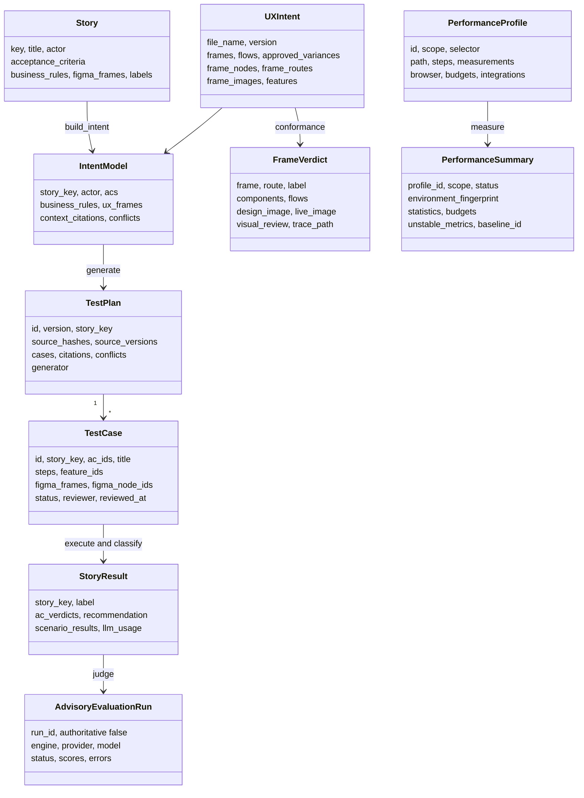

Figure: Core data model — stories and designs become intent, intent becomes versioned plans, approved cases become evidence and verdicts; profiles become performance summaries; finished results can be judged advisorily.

### 6.1 Inputs

| Model | Fields |
|---|---|
| `AcceptanceCriterion` | `id` (AC-NN), `text` |
| `Story` | `key`, `title`, `type`, `status`, `priority`, `actor`, `description`, `acceptance_criteria`, `business_rules`, `figma_frames`, `labels` |
| `UIComponent` | `node_id`, `kind`, `label`, `required`, `columns`, `navigates_to`, `box` {x, y, width, height} |
| `UXFeature` | `id`, `name`, `frames`, `node_ids`, `story_keys`, `ac_ids` |
| `UXIntent` | `file_name`, `version`, `frames` {frame: components}, `flows` [{from_frame, trigger, trigger_label, to_frame}], `approved_variances` [{frame, node_id, label, allowed_labels or allowed_kinds, reason}], `frame_nodes`, `frame_routes` {frame: {path, requires_login}}, `frame_images` {frame: {path, width, height, source}}, `features` |

### 6.2 Intent and plans

| Model | Fields |
|---|---|
| `ACIntent` | `id`, `text`, `precondition`, `action`, `expected`, `checks`, `ambiguous`, `ambiguity_reason` |
| `IntentModel` | `story_key`, `actor`, `acs`, `business_rules`, `ux_frames`, `context_sources`, `context_citations`, `conflicts` |
| `CitationRef` | `id` (C1..), `source`, `chunk_id`, `score`, `excerpt` (240 chars) |
| `ConflictNote` | `kind` (missing_rule, rule_vs_story), `severity` (info, warning, error), `detail` |
| `Scenario` / `ScenarioPlan` | `id`, `story_key`, `ac_ids`, `title`, `rationale`, `steps` / `scenarios` |
| `TestCase` | scenario fields + `feature_ids`, `figma_frames`, `figma_node_ids`, `citations`, `status`, `reviewer`, `review_comment`, `reviewed_at` |
| `TestPlan` | `id`, `version`, `story_key`, `story_title`, `created_at`, `source_hashes` {path: sha256}, `source_versions` {figma: file version}, `cases`, `citations`, `conflicts`, `generator` (provider:model) |

### 6.3 Steps

| Model | Fields |
|---|---|
| `Target` | `role`, `name`, `label`, `text`, `testid` (any subset; `describe()` renders it) |
| `Step` | `action` (goto, fill, click, select, expect_visible, expect_hidden, expect_text, expect_value, expect_readonly, expect_url, expect_rows, check_calculation, figma_check, measure_load, screenshot), `target`, `value`, `values`, `path`, `contains`, `text`, `name`, `frame` |

### 6.4 Results

| Model | Fields |
|---|---|
| `StepResult` | `index`, `action`, `description` (masked), `status`, `detail`, `screenshot`, `data` (elapsed_ms, actual, rows, findings...) |
| `ScenarioResult` | `scenario_id`, `ac_ids`, `title`, `steps`, `trace_path`, `network_path`, `duration_ms` |
| `ACVerdict` | `ac_id`, `text`, `label`, `rationale`, `scenario_ids`, `evidence` (run-relative paths) |
| `StoryResult` | `story_key`, `title`, `label`, `ac_verdicts`, `recommendation`, `scenario_results`, `intent_path`, `scenarios_path`, `llm_usage`, `duration_ms`, `error` |
| `FlowCheck` | `trigger_label`, `to_frame`, `expected_path`, `observed_url`, `status` (ok, missing, mismatch, error), `detail` |
| `VisualReview` | `summary`, `observations` [{area, difference, severity low/medium/high}] |
| `FrameVerdict` | `frame`, `node_id`, `route`, `label`, `rationale`, `components`, `flows`, `design_image`, `live_image`, `design_size`, `visual_review`, `trace_path`, `duration_ms` |

### 6.5 Performance

| Model | Fields |
|---|---|
| `PerformanceConfig` | `version`, `enabled`, `auto_run_with_approved_tests`, `fail_on_regression`, `require_baseline`, `profiles`, `export` {prometheus_remote_write_url, otlp_endpoint, grafana_url, export_raw_samples} |
| `PerformanceProfile` | `id`, `enabled`, `description`, `scope`, `selector` {story, test_case, feature, frame, page, component}, `path`, `steps`, `measurements`, `browser`, `budgets`, `integrations`, `tool_options`, `tags` |
| `PerformanceMeasurement` | `id`, `start` (navigation, before-action, app-mark), `end` {kind: network-idle, load, dom-content-loaded, visible, hidden, url, response, app-mark; target; value; timeout_ms 100–120000}, `action_index`, `metrics` |
| `BrowserPerformanceConfig` | `viewport` (1280×800), `cache_modes` (cold, warm), `warmups` (1, ≤20), `iterations` (5, ≤100), `cpu_slowdown` (1–20), `latency_ms`, `download_kbps`, `upload_kbps`, `fresh_context_per_iteration`, `capture_trace_on_regression` |
| `PerformanceBudget` | `metric`, `statistic` (median, p75, p90, p95, p99, max, mean; default p95), `max_value`, `max_regression_percent`, `severity` (warn, fail) |
| `PerformanceIntegrations` | `playwright` (true), `k6_browser`, `k6_protocol`, `lighthouse`, `opentelemetry`, `benchmarkdotnet`, `grafana_export` |
| `PerformanceSample` | `profile_id`, `measurement_id`, `metric`, `value`, `unit` (ms, bytes or none), `iteration`, `cache_mode`, `tags`, `trace_id` |
| `MetricStatistics` | `count`, `minimum`, `maximum`, `mean`, `median`, `p75`, `p90`, `p95`, `p99`, `stddev`, `mad`, `cv` |
| `BudgetOutcome` | `metric`, `statistic`, `actual`, `baseline`, `regression_percent`, `max_value`, `max_regression_percent`, `passed`, `severity`, `reason` |
| `PerformanceSummary` | `profile_id`, `scope`, `status`, `environment_fingerprint`, `statistics`, `budgets`, `unstable_metrics`, `baseline_id`, `baseline_statistics` |
| `PerformanceRun` | `schema_version`, `run_id`, `started_at`, `completed_at`, `enabled`, `summaries`, `samples`, `tools`, `warnings`, computed `passed` (no FAIL or UNSTABLE summary) |
| `PerformanceBaseline` | `id` (`<run>-<12 hex of fingerprint>`), `profile_id`, `approved_by`, `approved_at`, `source_run_id`, `environment_fingerprint`, `statistics` |

### 6.6 Advisory evaluation

| Model | Fields |
|---|---|
| `AdvisoryEvaluationConfig` | `schema_version`, `enabled`, `engine` (deepeval-geval), `authoritative` (always false), `fail_open`, `judge`, `metrics`, `dashboard_export`; metric ids must be unique |
| `JudgeConfig` | `provider` (ollama, vllm, openai-compatible), `model`, `base_url`, `api_key_env`, `timeout_seconds` |
| `AdvisoryMetricConfig` | `id`, `name`, `criteria`, `threshold` (0–1), `enabled`, `evaluation_steps` |
| `DashboardExportConfig` | `enabled`, `backend` (opik, langfuse, generic-otlp), `otlp_endpoint`, `fail_open` |
| `AdvisoryScore` | `story_key`, `metric_id`, `metric_name`, `score` (0–1), `threshold`, `meets_threshold`, `reason` |
| `AdvisoryEvaluationRun` | `run_id`, `enabled`, `authoritative` false, `engine`, `provider`, `model`, `status`, `meets_advisory_threshold`, `scores`, `errors`, `exports` |

## 7. Inputs catalogue

| Input | Location / source | Format | Consumed by |
|---|---|---|---|
| Stories | `stories/*.json` | `Story` JSON | orchestrator, RAG, chat, MCP |
| Figma design | `fixtures/blog_notes.figma.json` or Figma REST file | Figma file JSON + `x-` metadata keys | Figma MCP → `UXIntent` |
| Frame images | `fixtures/frames/*.png` or Figma images API | PNG | conformance, report, vision review |
| Business rules | `knowledge_base/business_rules.md` | Markdown, `### BR-XXX-NN title` headings | RAG, intent, scenarios |
| API/UI contract | `knowledge_base/api_contract.md` | pages, endpoints, test ids, DB tables | RAG |
| Test data | `knowledge_base/test_data.md` | seeded users, posts, filter expectations | RAG, scenario values |
| Flow prerequisites | `knowledge_base/flow_test_data.json` | `{"<frame>/<trigger>": [{label, value}]}` | conformance, RAG |
| Target profile | `TARGET_PROFILE` JSON | health path, origins, auth labels, list path, row test id, capabilities, features | generic adapter |
| Feature map | `TARGET_FEATURE_MAP` JSON | `{"features": [...]}` | plan feature links |
| Storage state / headers | `TARGET_STORAGE_STATE`, `TARGET_HEADERS_JSON` | Playwright state file / JSON object | generic adapter auth |
| Tool registry | `config/tools.json` or `AGENT_TOOLS_CONFIG` | `RegistryConfig` | chat, recovery, MCP |
| Reviewed workbook | `test_plans/<story>/vN.xlsx` | edited `.xlsx` | `review import` |
| Performance profiles | `config/performance.json` or `PERFORMANCE_CONFIG` | `PerformanceConfig` | performance runner, MCP |
| Approved baselines | `performance-baselines/<profile>/` | `PerformanceBaseline` JSON + `LATEST` | relative budgets, Grafana overlay |
| BenchmarkDotNet artifact | `tool_options.benchmarkdotnet_json` | BenchmarkDotNet JSON export | performance import |
| Advisory judge config | `config/advisory-evaluation.json` | `AdvisoryEvaluationConfig` | advisory evaluation |
| Gold labels | `evals/gold_labels.json`, `evals/retrieval_gold.json` | expected AC/frame labels; retrieval cases | evals |

Sample story (BLOG-103): three ACs — metadata columns, word count per BR-META-01, reading time `ceil(Words / 200)` with a minimum of 1 per BR-META-02; linked frame My Blogs; labels posts, calculation.

Shipped performance profiles (`config/performance.json`, top-level `enabled: false`):

| Profile | Scope | Selector | Measures | Budgets | Enabled |
|---|---|---|---|---|---|
| `blogs-page` | page | page `/blogs` | navigation to `/blogs`, cold and warm, 1 warm-up + 5 iterations | warm wall p90 ≤ 2000 ms and ≤ 15% regression (fail); warm LCP p90 ≤ 2500 ms (warn) | yes |
| `tag-filter-feature` | feature | feature `tag-filter` | select "ai" in Filter by tags until network idle, warm | warm interaction p95 ≤ 1000 ms and ≤ 15% regression | yes |
| `tag-filter-component` | component | component `tag-filter` | select "travel" on `/blogs`, warm | warm interaction p95 ≤ 1000 ms (warn) | yes |
| `blogs-api-protocol` | api | feature `post-list` | k6 protocol on `/api/posts`, 10 iterations | `http_req_duration` p95 ≤ 1000 ms | no |
| `blogs-read-load` | load | page `/blogs` | k6 protocol load on `/api/posts`, 25 iterations | `http_req_duration` p95 ≤ 1200 ms | no |

## 8. Outputs catalogue

### 8.1 Run folder

```
runs/<run-id>/                    run id = YYYYMMDD-HHMMSS (performance-only: ...-perf); runs/LATEST holds the newest
├── report.html                   human-readable verdicts with evidence links
├── results.json                  meta + figma_conformance + stories + performance + advisory_evaluation (masked)
├── eval.json                     deterministic artifact audit
├── advisory-eval.json            optional advisory judge scores (never authoritative)
├── performance.json              optional PerformanceRun (samples + summaries)
├── performance/
│   ├── metrics.prom              Prometheus text exposition
│   └── <profile>/                summary.json, samples.json, k6.generated.js, k6-summary.json, k6.log,
│                                 lighthouserc.json, lighthouse-results/, benchmarkdotnet.json
├── figma/<frame-slug>/
│   ├── design.png, live.png      design export and live screenshot (1280×800)
│   ├── verdict.json              FrameVerdict
│   ├── step-NN-<action>.png      login and flow-check screenshots
│   ├── trace.zip                 Playwright trace, secrets scrubbed
│   └── network.json              /api/ calls, masked
└── <STORY>/
    ├── intent.json, scenarios.json, result.json
    └── <SCENARIO>/
        ├── step-NN-<action>.png, trace.zip, network.json
        ├── calculation-<name>.json   UI / API / expected / source words per post
        └── figma-<frame>.json        component findings from figma_check
```

`generate` writes to `runs/<run-id>-planning/` (intent and scenarios only) and to the plan catalogue.

### 8.2 `results.json`

`meta`: run_id, author, stage_base_url, llm_provider, llm_model, ux_source, embedder, figma_llm_usage, and for approved runs approved_plan_ids, selector, approved_cases, plan_sources_fresh, plus the embedded evaluation. `figma_conformance`: list of `FrameVerdict`. `stories`: list of `StoryResult`. `performance`: `PerformanceRun` or null. `advisory_evaluation`: `AdvisoryEvaluationRun` or null. Use it for CI gates (for example fail on any DEFECT or GAP, or on a FAIL/UNSTABLE performance summary) or dashboards.

### 8.3 `eval.json`

`schema_version` 1, `run_id`, `passed`, `summary` {checks, passed, failed}, `checks`:

| Check | Passes when |
|---|---|
| `artifacts` | `results.json` parses and `report.html` exists |
| `story_labels` | every story label equals the highest-precedence AC label; structure valid; labels known |
| `evidence` | every referenced file exists inside the run; every AC links a trace and a screenshot per scenario; every frame has design, live and trace |
| `secrets` | no configured secret, `OPENAI_API_KEY`, `AZURE_OPENAI_API_KEY`, `STAGE_PASSWORD`, `GITHUB_TOKEN`, `GH_TOKEN` value, `sk-` key, GitHub token or private key in any file or zip member (20 MB per member, 100 MB per archive) |
| `gold` | optional: AC and frame labels equal the gold labels |
| `approved_coverage` | approved runs only: every selected case executed, its ACs classified, citations present, selector respected, sources fresh |
| `performance` | runs with performance only: `performance.json` parses; statuses are known; every summarized metric has at least as many retained raw samples as its count; budget outcomes well formed; the summaries in `results.json` equal those in `performance.json` (tamper check) |

An audit failure never rewrites a label; it makes `run`, `run-approved` and `performance run` exit with code 3.

### 8.4 Test plans and review workbook

`test_plans/<story>/vN.json` (canonical, immutable except review fields), `LATEST`, and `vN.xlsx`:

| Sheet | Columns |
|---|---|
| Summary | plan_id, version, story_key, story_title, created_at, generator |
| Test Cases | case_id, story_key, ac_ids, title, rationale, status, reviewer, review_comment, reviewed_at, feature_ids, figma_frames, figma_node_ids |
| Steps | case_id, index, action, target_role, target_name, target_label, target_text, target_testid, value, values_json, path, contains, expected_text, name, frame |
| Coverage | ac_id, case_ids |
| Sources | citation_id, source, chunk_id, score, excerpt |
| Human Review | case_id, status, reviewer, comment |
| Results (after run) | story_key, ac_id, label, rationale, evidence |
| Evaluation (after run) | check, passed, details; final row overall |
| Performance (after run, when measured) | profile, scope, status, metric, count, median, p90, p95, p99, cv, budget |

### 8.5 Other outputs

`.rag_index/` (`vectors.npy`, `chunks.json`, `manifest.json`), `.figma_cache/*.png`, `performance-baselines/<profile>/<id>.json` and `LATEST`, OTLP metrics and spans when exports are enabled, `evals/results/eval-<timestamp>.md` (metrics table and flaky ACs), and `llm/replay/<task>/<key>.json` when recording.

### 8.6 `report.html`

Sections top to bottom: run header (run id, author, target URL, LLM, UX source, embedder); run artifact evaluation (every `eval.json` check); advisory evaluation (when enabled: status, judge, per-story scores and thresholds, labelled as non-authoritative); performance (when measured: overall PASS/FAIL, per profile and metric count, median, p90, p95, p99, CV and budget reasons, links to `performance.json` and `metrics.prom`); Figma conformance summary (frame, route, label, rationale); one card per frame with design and live images side by side and problem components outlined at their Figma position (red for missing or mismatch, amber for approved variances), component table, prototype flow table, advisory visual review and evidence links; requirement assurance summary per story; one section per story with the recommendation, a row per AC with label, rationale and evidence links, and scenario step tables including calculation rows and Figma findings.

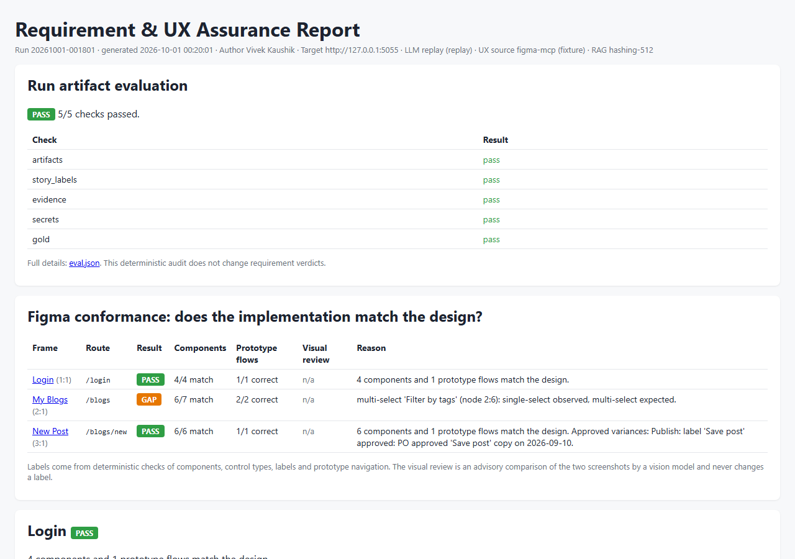

Figure: Top of `report.html` for the sample assurance run — header, artifact audit, and the Figma conformance summary.

### 8.7 Results from a real assurance run

The charts below are generated by `docs/design/build_docs.py` from run `20261001-001801` (replay LLM, hashing embeddings, fixture Figma, local StageUI). Five stories, 15 acceptance criteria, 16 scenarios and 107 steps; 12 PASS, 1 DEFECT, 1 GAP, 1 RISK — the expected labels. Frames: Login PASS, My Blogs GAP, New Post PASS. The artifact audit passed 5/5 checks over 213 evidence references.

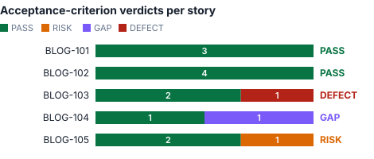 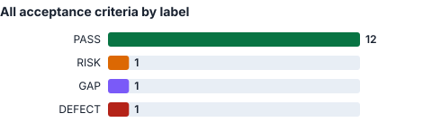

Figure: Left — acceptance-criterion labels per story with the story label on the right. Right — all criteria by label.

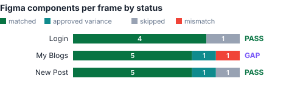 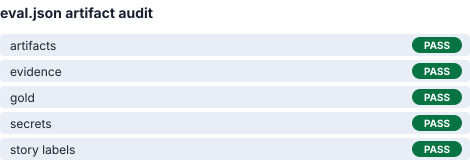

Figure: Left — Figma components per frame by status (My Blogs has one mismatch: the tag filter). Right — the `eval.json` audit.

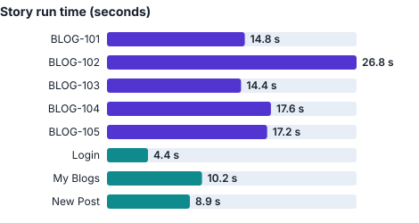

Figure: Wall time per story and per frame, including browser start-up, login and evidence capture.

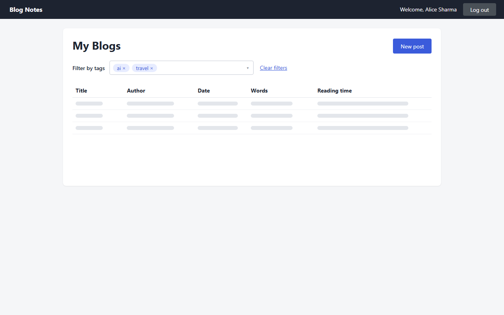 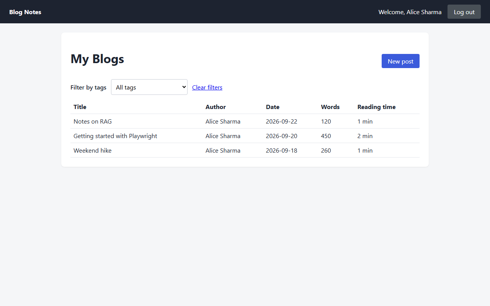

Figure: My Blogs — Figma design (left) and live StageUI (right). The design's multi-select "Filter by tags" is a single-select dropdown in the app, so the frame is GAP; "New post" rendered as a link is an approved variance.

| Finding | Evidence |
|---|---|
| BLOG-103 AC-03 DEFECT | `calculation-reading_time.json`: "Getting started with Playwright" 450 words → UI 2, API 2, rule 3; "Weekend hike" 260 words → UI 1, API 1, rule 2: the API breaks BR-META-02 |
| BLOG-104 AC-01 GAP | `figma_check`: node 2:6 single-select observed, multi-select expected; `select` of ai and travel impossible; following steps skipped |
| BLOG-105 AC-03 RISK | "should load fast" has no threshold; measured wall 563 ms, DOMContentLoaded 38 ms and reported only |

### 8.8 Results from a real performance run

Run `20261001-002514-perf` measured `blogs-page` and `tag-filter-feature` (Chromium 153, headless, no throttling, no baseline yet): 210 samples, `eval.json` 6/6 checks passed including the `performance` check. Both absolute budgets held, but `blogs-page` is **UNSTABLE** because two cold-cache API timings varied more than the CV limit of 0.35, so the command exited with code 3. This is the stability gate working as designed: an unstable measurement cannot pass or be promoted to a baseline. Relative budgets reported "not evaluated (no matching baseline)" until a baseline is promoted.

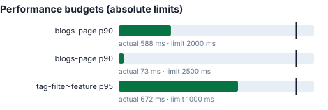 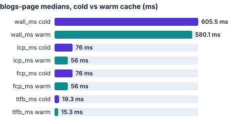

Figure: Left — each absolute budget with the measured statistic (bar) and its limit (black line). Right — `blogs-page` medians with and without the browser cache.

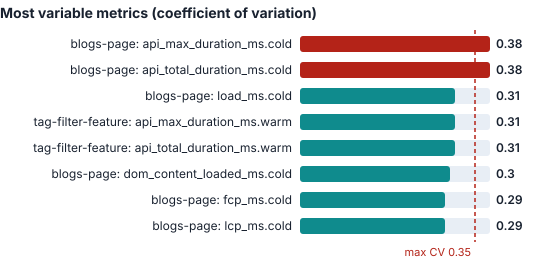

Figure: The most variable metrics in the run. Red bars exceed the maximum coefficient of variation and make their profile UNSTABLE.

| Profile | Status | Key statistics |
|---|---|---|
| `blogs-page` | UNSTABLE | warm wall p90 588 ms (limit 2000); warm LCP p90 73 ms (limit 2500); cold wall median 606 ms vs warm 580 ms; unstable: cold `api_max_duration_ms`, cold `api_total_duration_ms` |
| `tag-filter-feature` | PASS | warm interaction p95 672 ms (limit 1000), median 649 ms, CV below 0.01 |

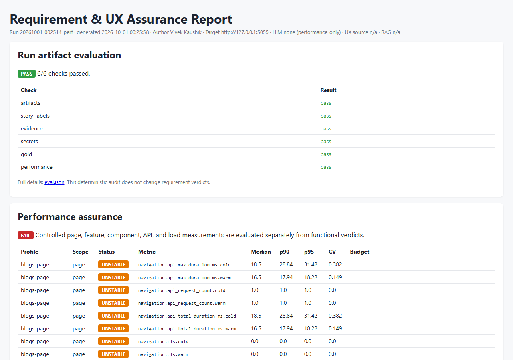

Figure: The performance section of `report.html` for the same run.

## 9. Configuration reference

All settings come from environment variables (usually `.env`, never committed).

| Area | Variable | Default | Meaning |
|---|---|---|---|
| LLM | `LLM_PROVIDER` | derived (§5.1) | openai, azure or replay |
| LLM | `OPENAI_API_KEY`, `OPENAI_BASE_URL` | — | OpenAI or any compatible endpoint |
| LLM | `OPENAI_MODEL`, `VISION_MODEL` | gpt-4o-mini, gpt-4o | planning and visual review models |
| LLM | `AZURE_OPENAI_ENDPOINT`, `AZURE_OPENAI_API_KEY`, `AZURE_OPENAI_API_VERSION`, `AZURE_OPENAI_DEPLOYMENT`, `AZURE_OPENAI_VISION_DEPLOYMENT` | api version 2024-10-21 | Azure OpenAI |
| LLM | `LLM_RECORD` | false | save live outputs as replays |
| RAG | `EMBEDDING_PROVIDER`, `EMBEDDING_MODEL` | openai if key else hashing; text-embedding-3-small | embeddings |
| RAG | `RAG_MODE`, `RAG_MIN_SCORE`, `RAG_RRF_K`, `RAG_INDEX_DIR` | hybrid, none, 60, .rag_index | retrieval |
| Target | `TARGET_ADAPTER` | stageui | stageui or generic_web |
| Target | `TARGET_BASE_URL` (`STAGE_BASE_URL`) | http://127.0.0.1:5055 | application origin |
| Target | `TARGET_USER` / `TARGET_PASSWORD` (`STAGE_USER` / `STAGE_PASSWORD`) | alice / — | login; password required for form login |
| Target | `TARGET_AUTH_METHOD` | form | form, storage_state, headers, none |
| Target | `TARGET_PROFILE`, `TARGET_FEATURE_MAP`, `TARGET_STORAGE_STATE`, `TARGET_HEADERS_JSON` | —, —, —, {} | generic target configuration |
| Target | `TARGET_HEALTH_PATH`, `TARGET_ALLOWED_ORIGINS`, `TARGET_READ_ONLY` | /login, base origin, false | reachability, origin allow-list, read-only mode |
| Target | `STAGE_DB_PATH`, `STAGE_RESET_MODULE`, `STAGE_PORT`, `STAGE_SECRET_KEY`, `STAGE_BOB_PASSWORD` | instance/blog.db, stageui_app.seed, 5055, random, random | reference app |
| Sources | `FIGMA_SOURCE`, `FIGMA_TOKEN`, `FIGMA_FILE_KEY` | fixture | Figma REST |
| Tools | `AGENT_TOOLS_CONFIG`, `AGENT_TOOL_CAPABILITIES` | config/tools.json, none | registry file and granted capabilities |
| Performance | `PERFORMANCE_ENABLED`, `PERFORMANCE_AUTO_RUN` | false, false | measure matching profiles after `run-approved` (either the variable or the config flag) |
| Performance | `PERFORMANCE_CONFIG`, `PERFORMANCE_BASELINES_DIR` | config/performance.json, performance-baselines | profiles and approved baselines |
| Performance | `PERFORMANCE_FAIL_ON_REGRESSION`, `PERFORMANCE_REQUIRE_BASELINE` | true, false | `performance run` exits 3 on FAIL/UNSTABLE (both this and the config flag must be true); treat a missing baseline as FAIL |
| Performance | `PERFORMANCE_MIN_SAMPLES`, `PERFORMANCE_MAX_CV` | 3, 0.35 | stability gate |
| Advisory | `ADVISORY_EVALUATION_ENABLED`, `ADVISORY_EVALUATION_CONFIG`, `ADVISORY_EVALUATION_API_KEY` | false, config/advisory-evaluation.json, — | optional DeepEval judge; the key is needed only for openai-compatible judges |
| Alchemist | `REQUIREMENTS_ALCHEMIST_CONFIG`, `RA_LLM_PROVIDER`, `RA_LLM_MODEL`, `RA_LLM_BASE_URL`, `RA_JIRA_PUSH_ENABLED`, `RA_REQUIRE_HUMAN_APPROVAL` | config/requirements-alchemist.json, replay, gpt-4o-mini, —, false, true | bundled story generator (§5.28) |
| Behaviour | `HEADLESS`, `MAX_RECOVERY_ATTEMPTS`, `STEP_TIMEOUT_MS` | true, 2, 5000 | browser |
| Paths | `RUNS_DIR`, `TEST_PLANS_DIR` | runs, test_plans | outputs |

Generic target profile keys: `health_path`, `allowed_origins`, `auth` {login_path, username_label, password_label, submit_name}, `list_path`, `row_title_testid`, `capabilities`, `features`. Performance `tool_options` keys: `method`, `path`, `duration`, `vus`, `k6_command`, `prometheus_remote_write_url`, `lighthouse_command`, `benchmarkdotnet_json`, `timeout_seconds`.

## 10. CLI reference

| Command | Effect | Exit codes |
|---|---|---|
| `python -m agent ingest` | build or confirm the RAG index | 0 |
| `python -m agent search "<query>" [-k 5]` | print ranked chunks | 0 |
| `python -m agent figma` | frames, nodes, routes, images, variances via MCP | 0 |
| `python -m agent graph` | orchestrator graph as Mermaid | 0 |
| `python -m agent run --story KEY ... or --all [--no-reset] [--start-stage] [--headed] [--no-figma]` | conformance then story assurance | 0 eval passed, 3 eval failed, 2 target unavailable or password missing |
| `python -m agent conformance [--start-stage] [--headed]` | Figma conformance only | same |
| `python -m agent generate --story KEY ... or --all [--excel]` | draft plan versions, optional workbook | 0 |
| `python -m agent review export or import --story KEY [--version N] [--file path]` | review projection round trip | 0; validation errors raise |
| `python -m agent plans [--story KEY]` | list plans and status counts | 0 |
| `python -m agent run-approved --story KEY or --frame NAME or --feature ID [--start-stage] [--no-reset] [--allow-stale]` | approved cases only, plus matching performance profiles when enabled | 0, 2 no match / stale / unavailable, 3 eval failed (a FAIL or UNSTABLE performance summary is reported, not gated) |
| `python -m agent performance list` | profiles, scopes and whether performance is enabled | 0 |
| `python -m agent performance run [--profile ID ...] [--story, --feature, --page or --component VALUE] [--start-stage] [--headed]` | measure profiles into a `-perf` run with report and eval | 0, 2 unavailable, 3 FAIL/UNSTABLE or eval failed |
| `python -m agent performance promote --run RUN --profile ID --approved-by NAME` | promote a measured summary to an approved baseline | 0, 2 missing arguments, failing eval, missing results or unmeasured profile |
| `python -m agent chat [--headed] [--once "question"]` | LLM-driven chat | 0, 2 without a live LLM |
| `python -m evals.run_eval --runs 3 --start-stage` | repeated-run metrics vs gold | 0 |
| `python -m evals.run_retrieval_eval` | offline retrieval hit@k, recall@k, MRR | 0, 1 if hit@k is below the gold minimum |
| `python -m mcp_servers.<server>.server` | start an MCP server over stdio | — |
| `python -m stageui_app.seed` / `python -m stageui_app` | reset / start the reference app | — |
| `python -m requirements_alchemist` | start the bundled story generator on port 5070 | — |

## 11. Processing flows

### 11.1 Story assurance (LangGraph)

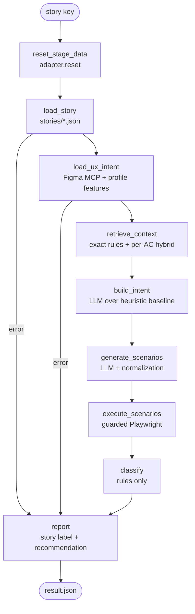

Figure: One story run. Ingestion errors short-circuit to a RISK result instead of guessing.

### 11.2 Governed plan lifecycle

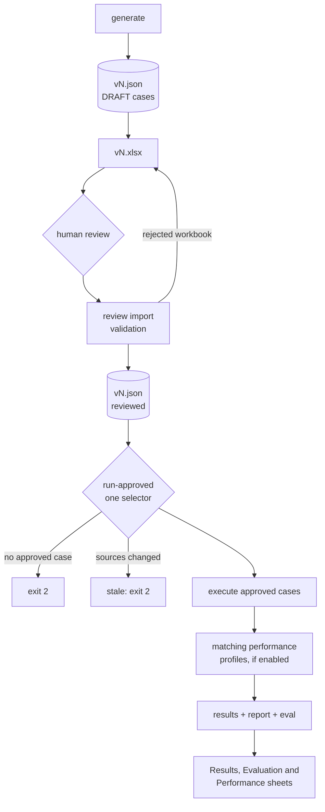

Figure: Test design is separated from execution; nothing runs until a person approves it and the sources are unchanged.

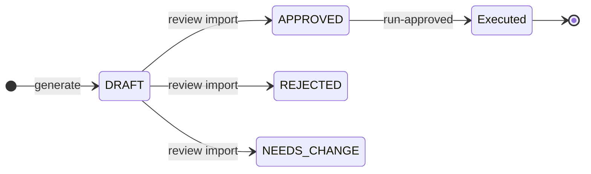

Figure: Review states of a test case. A later import may set any state again; regeneration creates a new plan version whose cases start as DRAFT. Only APPROVED cases are selectable for execution.

### 11.3 Figma conformance per frame

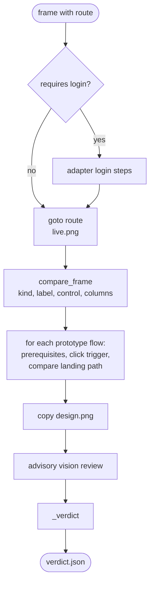

Figure: Frame conformance. Missing or mismatched components are GAP, a wrong landing page is DEFECT, a missing trigger is GAP, login or guardrail failures are RISK.

### 11.4 Step execution with bounded recovery

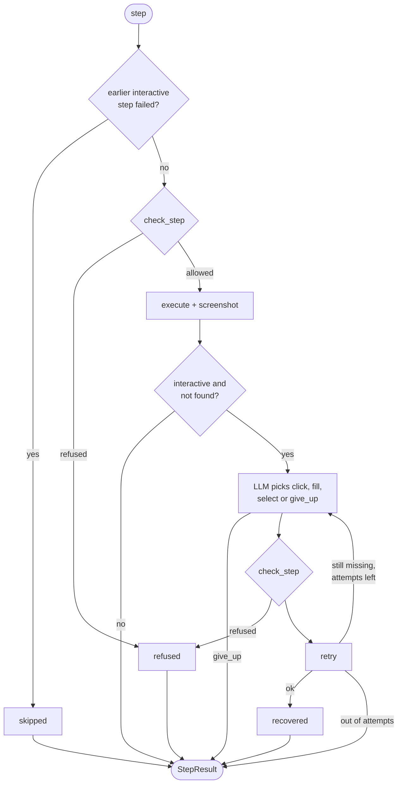

Figure: Every planned or recovered step passes the same guardrail. Recovery is capped; a successful recovery is recorded as recovered (RISK), and a failed one keeps the original missing status (GAP).

### 11.5 Four-way calculation check

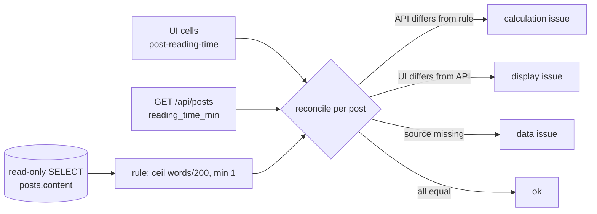

Figure: The calculation probe separates a wrong rule implementation from a display bug and from bad data.

### 11.6 Performance measurement

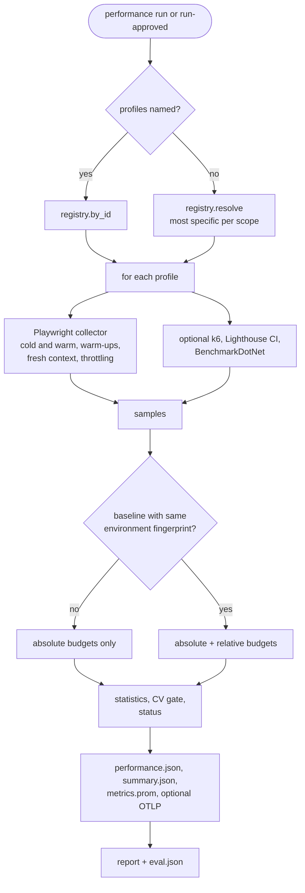

Figure: Profiles are measured repeatedly, summarized with percentiles and a variability gate, and compared with an approved baseline only when the environment matches.

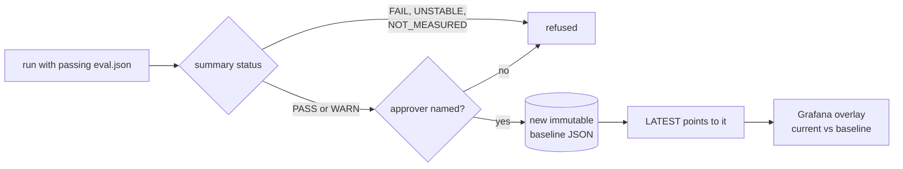

Figure: Baseline promotion is a human decision recorded with the approver; an existing baseline file is never overwritten.

### 11.7 Advisory output evaluation

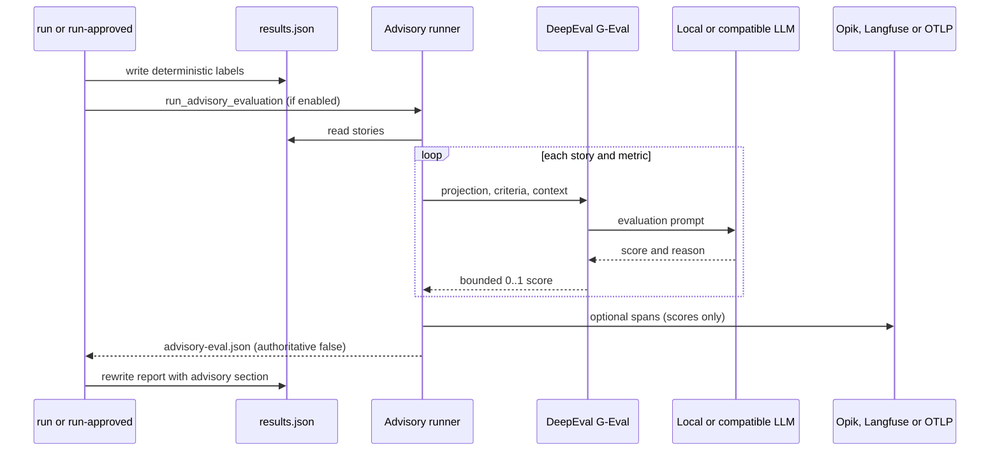

Figure: The judge scores how well the written recommendation reflects the deterministic labels; it cannot change a label or an exit code.

## 12. Classification rules

Per acceptance criterion (`classifier.classify`):

| Evidence | Label |
|---|---|
| No scenario cites the AC | RISK |
| Scenario without a trace or without screenshots | RISK |
| Step `mismatch` (wrong text, URL, value, rows, calculation, visible element) | DEFECT |
| Step `missing` (element, capability or Figma component absent) | GAP |
| Step `refused`, `error` or `recovered` | RISK |
| AC flagged ambiguous (vague word, no number) | RISK, even when checks pass |
| None of the above | PASS, with the number of checks and any approved variances or measurements |

The highest-precedence finding wins; the rationale lists the winning reasons first and the others as "(also ...)". Steps after a failed interactive step are `skipped` and do not add findings, so one missing control produces a GAP rather than a cascade of false DEFECTs.

Per frame (`conformance._verdict`): login failure → RISK; component missing or mismatch → GAP; flow landing elsewhere → DEFECT; flow trigger missing → GAP; flow error or guardrail refusal → RISK; otherwise PASS with matched component and flow counts.

Per story: highest AC label (RISK if none). Recommendations: template text for PASS and replay mode; LLM text otherwise, never changing labels.

Per performance profile (`statistics.build_summary`), first match wins:

| Evidence | Status |
|---|---|
| No metric collected | NOT_MEASURED |
| A `fail`-severity budget is exceeded (absolute value or regression against the baseline) | FAIL |
| A metric has fewer than `PERFORMANCE_MIN_SAMPLES` samples or CV above `PERFORMANCE_MAX_CV` | UNSTABLE |
| A `warn`-severity budget is exceeded | WARN |
| Otherwise | PASS |

A budget whose metric was not collected fails. When a baseline is required and none matches, a measured profile becomes FAIL. A run passes when no profile is FAIL or UNSTABLE.

## 13. Security design

| Risk | Control |
|---|---|
| Destructive actions | finite step language; destructive words in paths or targets refused; a refusal is RISK and blocks PASS; performance steps limited to goto, fill, click, select, screenshot |
| Leaving the target | navigation limited to allowed origins; URLs with embedded credentials refused; optional read-only mode |
| Data access | SQLite `mode=ro`, single SELECT only |
| Credentials in prompts | placeholders resolved only inside the browser session; the LLM and the advisory judge never see values |
| Credentials in generated scripts | k6 scripts reference `__ENV.TARGET_USER` / `__ENV.TARGET_PASSWORD`; values are passed only in the k6 process environment |
| Credentials in evidence | masking in step details, `network.json`, `results.json`, report and chat output; `scrub_zip` for traces (raw and URL-encoded); `eval.json` secret scan over every file and archive member |
| Hallucinated requirements | intent saved before execution; unknown AC ids dropped; hard-coded derived numbers removed; ambiguous ACs forced to RISK |
| Spreadsheet attacks | `.xlsx` only, 10 MB and 10,000-step limits, formula-like prefixes rejected, credential-like values and configured secrets rejected, plan id/version must match, unknown columns/cases/ACs rejected, every step re-validated by `check_step`, contiguous step indexes, valid review states |
| Tool abuse | registry authorization by surface, risk and capability, schema validation and timeouts; chat limited to 8 rounds; MCP surface limited to low risk |
| Model authority | vision review, recommendations and advisory scores are advisory; `authoritative` is fixed to false in the advisory schema; OTLP export carries scores, never recommendation text |
| Metric tampering and cardinality | `eval.json` compares performance summaries in `results.json` with `performance.json` and requires raw samples; run and trace ids stay out of Prometheus labels |
| Unreviewed baselines | promotion needs a passing run audit, a PASS or WARN summary and a named approver; baseline files are immutable |
| Observability exposure | compose services bind to 127.0.0.1; the Grafana admin password lives in an uncommitted `observability/.env` |
| Report injection | Jinja autoescape |
| Run id traversal (MCP) | run directory must be a direct child of `runs/` |
| Secrets in git | `.env`, `.env.*`, `*.key`, `*Key.txt`, runs and plans are gitignored; baselines hold statistics only |

## 14. Error handling and failure analysis

| Situation | Behaviour |
|---|---|
| Story or Figma ingestion fails | story result RISK with the error and "Fix ingestion and re-run" |
| No LLM key and no replay | heuristic intent; empty plan; every AC RISK with an explanatory note |
| LLM JSON invalid twice | `ValueError`; recommendation falls back to the template |
| Target unreachable | exit 2 (or start it with `--start-stage` for local adapters) |
| Missing password for form login | exit 2 before any browser starts |
| Stale plan or no approved case | exit 2 unless `--allow-stale` |
| Unknown adapter or auth method, missing profile or storage state | `ValueError` / `FileNotFoundError` |
| Invalid performance config, duplicate or conflicting profiles | validation error or `ValueError` before measuring |
| k6, `lhci` or BenchmarkDotNet artifact missing | the script or config is still written; a warning is recorded and no samples are added |
| OTLP export fails | warning recorded in `performance.json`; the run continues |
| Baseline from a different environment | ignored with a warning; only absolute budgets apply |
| DeepEval not installed or judge unreachable | with `fail_open`: status ERROR or PARTIAL in `advisory-eval.json`; otherwise the exception stops the run |
| Audit failure | `eval.json` written, exit 3, labels unchanged |

Lessons recorded during development: `mcp` 2.x broke `FastMCP` (pinned `<2`); traces contained the password (now scrubbed); a failed multi-select cascaded into a false DEFECT (later steps now skipped); live plans used label targets for buttons and hard-coded reading times (equivalent locator forms and plan normalization); the vision model flagged conditional errors and approved copy (filtered, and gpt-4o replaces gpt-4o-mini, cutting image tokens from about 222k to 8k per run); the vision model misses multi-select vs dropdown (accepted — the deterministic check finds it); cold-cache API timings on a laptop can vary beyond the CV limit (the UNSTABLE status reports this instead of producing a misleading PASS).

## 15. Testing and evaluation

87 pytest test functions in 18 modules, collected as 90 cases because the registry authorization test is parametrized four ways (`python -m pytest`, all offline, 90 passed on this branch).

| Module | Tests | Covers |
|---|---|---|
| `test_adapters.py` | 4 | generic form login placeholders, storage-state and header auth, exact-origin and read-only guardrails, missing storage state |
| `test_advisory_evaluation.py` | 4 | disabled mode has no side effects; scores persisted as non-authoritative; report renders scores without changing verdicts; OTLP export carries bounded scores, not recommendation text |
| `test_chat.py` | 5 | tool call then answer, unknown story rejected, password masked in tool output, plain text, run summary |
| `test_classifier.py` | 4 | labels follow step evidence, ambiguous AC is RISK, no evidence cannot PASS, precedence |
| `test_conformance.py` | 5 | relative boxes and routes, frame images over MCP, frame verdicts, vision filtering, locator candidates |
| `test_evaluate_run.py` | 6 | valid run, label and evidence failures, secrets in files and zips, pattern detection, gold, missing artifacts |
| `test_excel_io.py` | 3 | round trip with a step edit, formula and secret rejection, external navigation rejection |
| `test_figma.py` | 3 | parser frames/components/flows, conditional components, MCP round trip scoped to a story |
| `test_guardrails.py` | 5 | destructive click, off-origin navigation, normal steps, placeholders and masking, trace scrub |
| `test_performance_foundation.py` | 6 | distribution statistics and variance, absolute and relative budgets, most-specific profile resolution, conflicting profiles, missing registry is disabled, human-controlled immutable baseline promotion |
| `test_performance_integrations.py` | 3 | k6 script without the executable, OTLP and Prometheus exports, disabled runner still writes its artifact |
| `test_performance_reporting.py` | 2 | performance rendered and audited; tampered results detected |
| `test_rag_and_intent.py` | 6 | markdown chunking, offline rule retrieval, unmeasurable AC, replay covers every AC, plan normalization, hard-coded numbers |
| `test_rag_hybrid.py` | 5 | stable metadata, filters, thresholds and exact lookup, manifest change detection, retrieval gold, portable index |
| `test_requirements_alchemist.py` | 14 | bundled generator: licensed reference retrieval, local Ollama profile keyless and write-safe, Excel review-only import and formula neutralizing, Jira description, assurance export, publish gating, HTTPS/allow-list/private-address source checks, chat masking, replay workflow, guided demo |
| `test_stageui_app.py` | 3 | login and user isolation, protected pages, seeded reading-time defect |
| `test_test_catalog.py` | 2 | versions and approved selection, frame filter |
| `test_tool_registry.py` | 7 | config loading and handlers, authorization, schema enforcement, invalid references, injected MCP executor, timeout |

`evals/run_eval.py` repeats full runs and reports AC coverage, label accuracy, known issues detected, false positives, flake rate, evidence completeness, median and max story latency, LLM calls, tokens and estimated cost, plus Figma frame accuracy and flake. Published replay result over three runs: coverage 100%, label accuracy 100%, known issues 3/3, false positives 0, flake 0%, evidence completeness 100%. `evals/run_retrieval_eval.py` measures hit@k, recall@k and MRR on the checked-in retrieval gold set.

## 16. Build and documentation

| Artifact | Produced by |
|---|---|
| `docs/design/assets/run-*.svg`, `perf-*.svg`, `run-summary.json` | `python docs/design/build_docs.py [runs/<assurance-run>] [runs/<perf-run>]` from `results.json`, `eval.json` and `performance.json` |
| `assets/my-blogs-design.png`, `my-blogs-live.png`, `report-overview.png`, `performance-report.png` | same script (copies frame evidence, screenshots both reports) |
| `prux-assurance-agent-complete-reference.pdf` | same script, or `python docs/design/render_pdf.py <file.md>` |

Without arguments the script picks the newest run with stories and frames and the newest run with performance samples. `render_pdf.py` loads marked and Mermaid from jsDelivr in Playwright Chromium, adds a cover page, a table of contents and numbered figure captions, and fails if a Mermaid diagram or an image does not render.

## 17. Limitations and roadmap

- Stories come from `stories/*.json`; a live Jira REST source is not part of this branch.
- Row-list and calculation probes exist only for the StageUI adapter; generic targets report them as RISK.
- Conformance compares semantics (kind, label, control type, columns, flows), not pixels; the visual review is advisory.
- Figma routes, story links, features and variances are file-level metadata; a real file maps them to Dev Mode links and annotations.
- Known issue: the shipped `tag-filter-component` profile fails with "Execution context was destroyed". Its measured select submits the filter form and navigates, and the collector reads page metrics while that navigation is still in flight. The feature-scoped profile measures the same interaction and completes. A fix is to wait for the load state after a navigating step before reading metrics.
- With `config/performance.json` `enabled: false`, `performance run` without `--profile` matches no profiles even though the command forces the runner on; name the profiles explicitly or enable the config.
- `run-approved` reports matching performance summaries but its exit code follows only the run audit; use `performance run` (exit 3 on FAIL or UNSTABLE) as the performance gate.
- The MCP `run_performance_profile` tool needs the target to be running already.
- k6, Lighthouse CI and the observability stack are optional external tools and were not exercised in the published run.
- Roadmap: a navigation-aware settle in the collector; a Jira REST source behind the existing functions; more adapter probes for generic targets; CI jobs that gate on `results.json` and `performance.json`.
