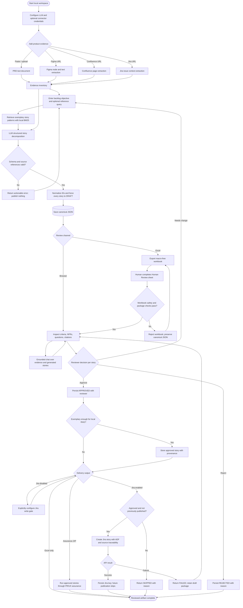
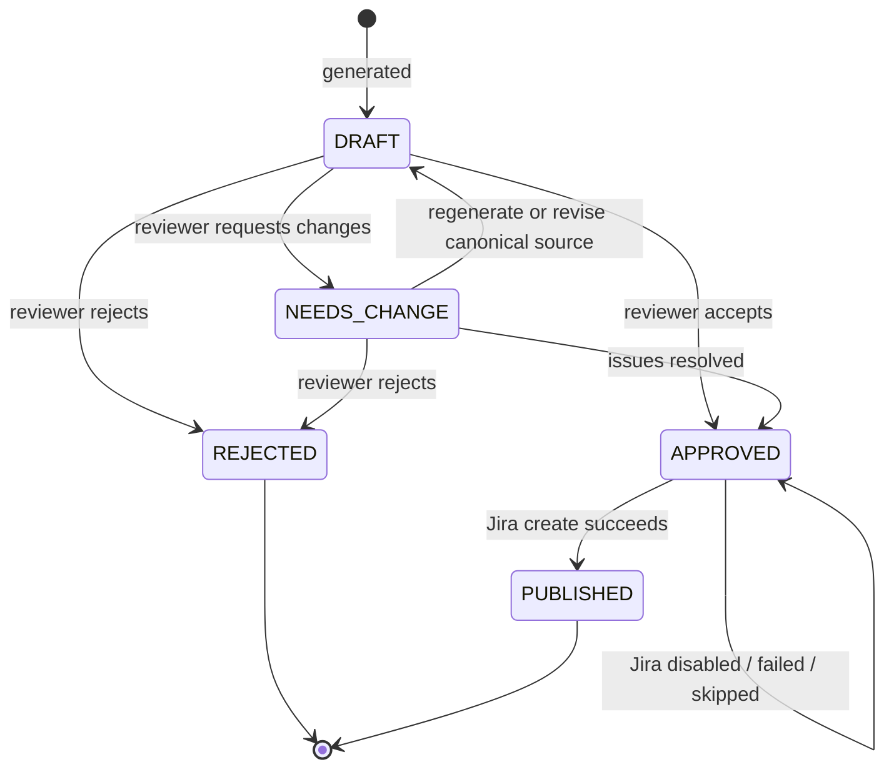

# Requirements Alchemist — end-to-end flow

**Author:** Vivek

## Product flow



## Generation sequence

```mermaid
sequenceDiagram
    actor User
    participant UI as Browser UI
    participant WS as Workspace
    participant SL as Source Loader
    participant RAG as BM25 Corpus
    participant LLM as Configured LLM
    participant V as Pydantic Validator
    participant FS as Canonical JSON

    User->>UI: Add PRD/Figma/Confluence/Jira
    UI->>WS: CSRF-protected source request
    WS->>SL: Validate and load
    SL-->>WS: SourceDocument
    WS->>RAG: Rebuild source + reference chunks
    User->>UI: Generate(title, objective)
    UI->>WS: GenerationInput
    WS->>RAG: Search exemplary patterns
    RAG-->>WS: Licensed/provenanced chunks
    WS->>LLM: Policy + evidence + patterns + JSON schema
    LLM-->>WS: Story package JSON
    WS->>V: Validate contracts
    alt Invalid output
        V-->>UI: Validation error; no package persisted
    else Valid output
        V->>V: Normalize IDs, citations, DRAFT state
        V->>FS: Atomic package projection
        V-->>UI: Reviewable StoryPackage
    end
```

## Human review and Jira sequence

```mermaid
sequenceDiagram
    actor Reviewer
    participant UI as Browser / Excel
    participant Canonical as StoryPackage JSON
    participant Gate as Publication Gate
    participant Jira as Jira Cloud

    Canonical-->>UI: Review projection
    Reviewer->>UI: APPROVED / NEEDS_CHANGE / REJECTED + comment
    UI->>Canonical: Review metadata only
    Reviewer->>Gate: Publish approved stories
    Gate->>Gate: Check feature flag, config, approval, existing Jira key
    alt Not eligible
        Gate-->>Reviewer: SKIPPED + explicit reason
    else Eligible
        Gate->>Jira: Create issue (ADF + labels + issue property)
        alt Created
            Jira-->>Gate: Issue key
            Gate->>Canonical: Persist Jira key
            Gate-->>Reviewer: CREATED + browse URL
        else API failure
            Jira-->>Gate: Error
            Gate-->>Reviewer: FAILED; canonical story remains unpublished
        end
    end
```

## State model



`PUBLISHED` is represented by an `APPROVED` story with a non-empty `jira_key`; it is shown
separately here to make the lifecycle explicit.
