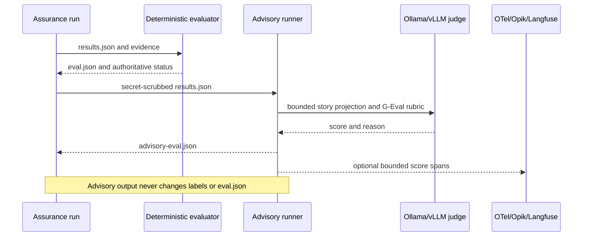

# Enhancement 001: Local Advisory Output Evaluation

| Field | Value |
|---|---|
| Status | Implemented |
| Author | Vivek |
| Date | 2026-09-30 |
| Parent PRD | [PRD-002](../prd/002-pluggable-assurance-platform.md) |
| Parent design | [Pluggable Assurance Architecture](../architecture/002-pluggable-assurance-platform.md) |

## Summary

PR-UX Assurance now supports an optional open-source advisory evaluation layer
for generated recommendations and evidence explanations. It uses DeepEval's
G-Eval metric and can run against a local Ollama or vLLM model through an
OpenAI-compatible endpoint.

The enhancement is disabled by default. It does not participate in
deterministic verdict assignment or the authoritative artifact quality gate.

## Why this enhancement exists

Deterministic assertions answer whether measured behavior met a requirement,
but generated explanations can still be incomplete, misleading, or
inconsistent with those measurements. The advisory evaluator checks:

1. whether recommendations preserve all deterministic labels;
2. whether claims remain grounded in supplied rationale and evidence;
3. whether incomplete evidence is directed to human review;
4. whether generated output invents observations or certainty.

These are qualitative checks and therefore remain advisory.

## Technology decision

| Concern | Decision |
|---|---|
| Evaluation framework | DeepEval, Apache 2.0 |
| Evaluation method | G-Eval with explicit criteria and evaluation steps |
| Default judge | Local Ollama using `qwen2.5:7b` |
| Alternative local judge | vLLM OpenAI-compatible server |
| Optional remote judge | Any explicitly configured OpenAI-compatible endpoint |
| Dashboard integration | Vendor-neutral OTLP spans for Opik, Langfuse, or another backend |
| Verdict authority | Existing deterministic classifier and `eval.json` only |

Jev was not selected because its model is proprietary, hosted, and early
access. DeepEval and G-Eval allow the framework and judge endpoint to remain
replaceable and locally operated.

## Runtime flow



## Configuration

Enable the feature:

```dotenv
ADVISORY_EVALUATION_ENABLED=true
ADVISORY_EVALUATION_CONFIG=config/advisory-evaluation.json
```

Install its optional dependency:

```powershell
pip install -r requirements-evaluation.txt
```

### Ollama

Start a local OpenAI-compatible Ollama endpoint and configure:

```json
{
  "judge": {
    "provider": "ollama",
    "model": "qwen2.5:7b",
    "base_url": "http://127.0.0.1:11434/v1"
  }
}
```

No external API key is required.

### vLLM

```json
{
  "judge": {
    "provider": "vllm",
    "model": "Qwen/Qwen2.5-7B-Instruct",
    "base_url": "http://127.0.0.1:8000/v1"
  }
}
```

### Remote compatible endpoint

Set `provider` to `openai-compatible`, configure the endpoint and model, and
store the secret only in the environment variable named by `api_key_env`.

## Metric contract

Each configured metric contains:

- stable `id` and display `name`;
- natural-language criteria or explicit ordered evaluation steps;
- threshold between zero and one;
- enabled state.

The first release supplies:

- `verdict-consistency`;
- `evidence-grounding`.

The result artifact contains:

```json
{
  "enabled": true,
  "authoritative": false,
  "engine": "deepeval-geval",
  "provider": "ollama",
  "model": "qwen2.5:7b",
  "status": "COMPLETE",
  "meets_advisory_threshold": true,
  "scores": [],
  "errors": [],
  "exports": []
}
```

## Failure behavior

- Disabled mode imports no DeepEval dependency and creates no advisory artifact.
- Missing optional dependencies are recorded as an advisory error when
  `fail_open` is enabled.
- Judge or export failures are visible in `advisory-eval.json` and the report.
- A low score produces an advisory warning, not a changed requirement verdict.
- Setting `fail_open` to false is available for evaluation-development jobs,
  but does not grant the evaluator verdict authority.

## Optional dashboards

`dashboard_export` can emit OTLP trace spans containing bounded metric IDs,
story IDs, scores, thresholds, and outcomes. The local OpenTelemetry Collector
can forward them to:

- self-hosted Opik;
- self-hosted Langfuse;
- another OTLP-compatible evaluation or observability backend.

Raw Jira text, recommendation text, secrets, and evidence files are not placed
in OTLP attributes. `advisory-eval.json` remains the portable canonical
advisory artifact.

## Security and governance

- Only secret-scrubbed `results.json` is evaluated.
- Credentials are read from environment variables and are never serialized.
- Deterministic labels are supplied as fixed context, not questions for the
  judge to reinterpret.
- Judge model, endpoint, criteria, steps, and thresholds are versioned.
- Human-labelled fixtures should calibrate every judge/model change.
- The model judge must not be used as the sole release gate.

## Implementation map

| File | Responsibility |
|---|---|
| `agent/evaluation/models.py` | Configuration and result contracts |
| `agent/evaluation/config.py` | Versioned JSON loading |
| `agent/evaluation/geval.py` | Lazy DeepEval G-Eval and local judge adapter |
| `agent/evaluation/runner.py` | Story projection, execution, persistence, failure policy |
| `agent/evaluation/exporters.py` | Optional OTLP score spans |
| `config/advisory-evaluation.json` | Default-disabled configuration and rubrics |
| `requirements-evaluation.txt` | Optional DeepEval dependency |
| `tests/test_advisory_evaluation.py` | Disabled mode, authority, persistence, and report tests |

## Future enhancements

1. Add a human-labelled calibration dataset for each metric.
2. Compare local models by class-specific error and calibration, not only
   aggregate score.
3. Add pairwise recommendation comparison for prompt/model upgrades.
4. Add explicit human review queues in Opik or Langfuse.
5. Add image-capable advisory metrics only after screenshot-redaction policy
   and labelled visual-evaluation data are established.
